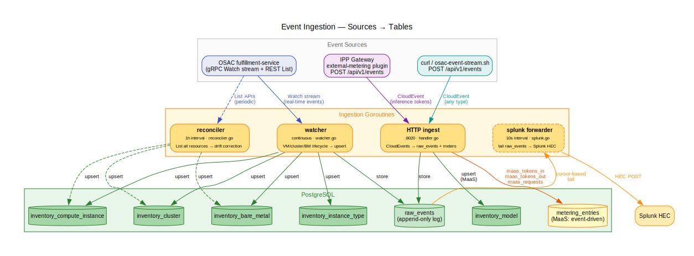
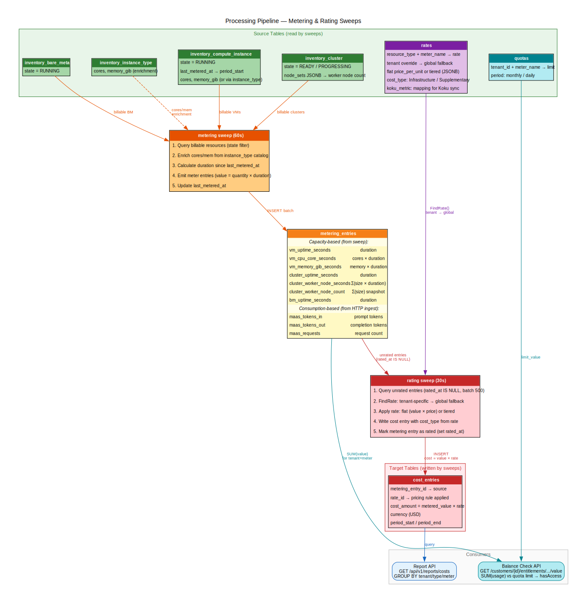
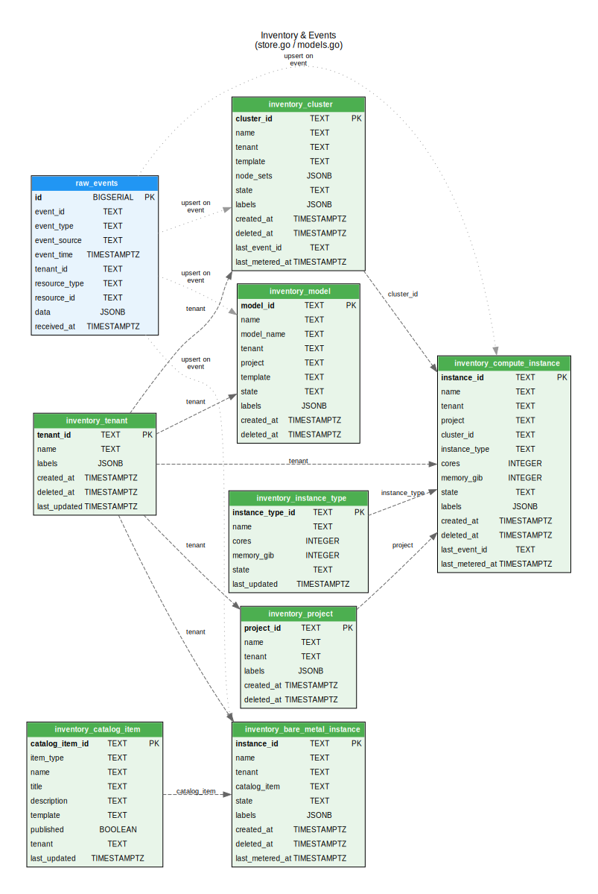
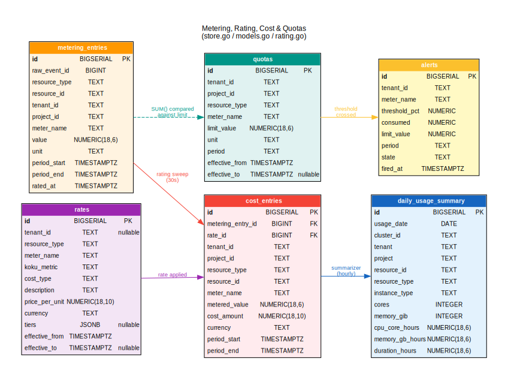

# Data Model

## Overview

The inventory-watcher uses PostgreSQL (port 5434) with tables organized
into two groups:

1. **Inventory & Events** — raw event log and current state of OSAC resources
2. **Metering, Rating & Quotas** — usage tracking, pricing, cost computation,
   and quota enforcement

**Schema source:** [`inventory-watcher/internal/inventory/store.go`](../inventory-watcher/internal/inventory/store.go)
**Go models:** [`inventory-watcher/internal/inventory/models.go`](../inventory-watcher/internal/inventory/models.go)
**Rating logic:** [`inventory-watcher/internal/rating/rating.go`](../inventory-watcher/internal/rating/rating.go)

## Goroutines

All goroutines are managed via `errgroup` + `safeGo` in
[`cmd/consumer/main.go`](../inventory-watcher/cmd/consumer/main.go).
Optional goroutines are activated by env vars.

| Goroutine | Interval | Purpose | Source |
|-----------|----------|---------|--------|
| **watcher** | continuous | Consumes OSAC Watch stream (gRPC). Upserts inventory on VM/cluster/BM lifecycle events. | [`internal/watcher/watcher.go`](../inventory-watcher/internal/watcher/watcher.go) |
| **reconciler** | 1h | Periodic List calls to OSAC to catch missed events (drift correction). | [`internal/reconciler/reconciler.go`](../inventory-watcher/internal/reconciler/reconciler.go) |
| **ingest** | HTTP server | Accepts CloudEvents via `POST /api/v1/events`. Serves report API, balance check, debug dashboard. | [`internal/ingest/handler.go`](../inventory-watcher/internal/ingest/handler.go) |
| **metering** | 60s | Sweeps billable VMs/clusters/BM, produces time-based metering entries (uptime, CPU, memory). | [`internal/metering/metering.go`](../inventory-watcher/internal/metering/metering.go) |
| **rating** | 30s | Picks up unrated metering entries, applies rates (flat or tiered), writes cost entries. | [`internal/rating/rating.go`](../inventory-watcher/internal/rating/rating.go) |
| **splunk** | 10s | Forwards raw events to Splunk HEC (cursor-based). Opt-in via `SPLUNK_HEC_URL`. | [`internal/splunk/forwarder.go`](../inventory-watcher/internal/splunk/forwarder.go) |

## Data Flow: Event Ingestion



*Source: [`docs/diagrams/data-flow-ingestion.dot`](diagrams/data-flow-ingestion.dot)*

How events enter the system and land in tables. The watcher and
reconciler handle capacity-based OSAC resources; the HTTP ingest
handles consumption-based MaaS events. The splunk forwarder tails
`raw_events` for audit export.

## Data Flow: Metering & Rating



*Source: [`docs/diagrams/data-flow-processing.dot`](diagrams/data-flow-processing.dot)*

The two processing sweeps. The metering sweep reads billable inventory
and produces usage entries (value = quantity x duration). The rating
sweep picks up unrated entries, applies pricing rules, and writes cost
entries. The balance check API compares metering usage against quotas.

## ERD: Inventory & Events



*Source: [`docs/diagrams/erd-inventory.dot`](diagrams/erd-inventory.dot)*

### Tables

| Table | Go Model | Purpose |
|---|---|---|
| `raw_events` | [`RawEvent`](../inventory-watcher/internal/inventory/models.go) | Append-only audit log. No unique constraint by default (throughput). Add `CREATE UNIQUE INDEX ON raw_events (event_id)` for dedup at cost of ~10% ingest speed. |
| `inventory_tenant` | [`TenantRecord`](../inventory-watcher/internal/inventory/models.go) | OSAC tenants — top-level grouping for all resources. |
| `inventory_project` | [`ProjectRecord`](../inventory-watcher/internal/inventory/models.go) | OSAC projects (Tenant → Project hierarchy). |
| `inventory_compute_instance` | [`ComputeInstanceRecord`](../inventory-watcher/internal/inventory/models.go) | VMs tracked from OSAC. `last_metered_at` for duration-based metering. |
| `inventory_cluster` | [`ClusterRecord`](../inventory-watcher/internal/inventory/models.go) | Clusters with `node_sets` JSONB for worker node tracking. |
| `inventory_model` | [`ModelRecord`](../inventory-watcher/internal/inventory/models.go) | MaaS model deployments (mock — OSAC doesn't have this yet). |
| `inventory_bare_metal_instance` | [`BareMetalInstanceRecord`](../inventory-watcher/internal/inventory/models.go) | Bare metal instances. References `catalog_item`. Metered for uptime. |
| `inventory_instance_type` | [`InstanceTypeRecord`](../inventory-watcher/internal/inventory/models.go) | Instance type catalog (cores, memory) synced from OSAC. |
| `inventory_catalog_item` | [`CatalogItemRecord`](../inventory-watcher/internal/inventory/models.go) | Catalog items (SKU definitions) for cluster, compute, and bare metal. Links template → published offering. |
| `splunk_cursor` | N/A (direct SQL in [`store.go`](../inventory-watcher/internal/inventory/store.go)) | Single-row cursor tracking `last_sent_id` for Splunk HEC forwarding. See [Splunk audit forwarding](splunk-audit-forwarding.md). |

### Relationships

- **Tenant** (`inventory_tenant`) is the top-level grouping; all inventory tables reference it via a `tenant` text field
- **Project** links to resources via the `tenant` field (same tenant scope)
- **InstanceType** is referenced by `inventory_compute_instance.instance_type` — used to enrich cores/memory when OSAC doesn't carry them on the instance
- **CatalogItem** is referenced by `inventory_bare_metal_instance.catalog_item`
- **Cluster** is referenced by `inventory_compute_instance.cluster_id`
- **raw_events** feeds all inventory tables via the watcher/ingest pipeline

## ERD: Metering, Rating & Quotas



*Source: [`docs/diagrams/erd-metering-cost.dot`](diagrams/erd-metering-cost.dot)*

### Tables

| Table | Go Model | Purpose |
|---|---|---|
| `metering_entries` | [`MeteringEntry`](../inventory-watcher/internal/inventory/models.go) | Per-meter-per-interval usage records. Produced by the 60s metering sweep (VMs/clusters) or on event arrival (MaaS). |
| `rates` | [`RateRecord`](../inventory-watcher/internal/inventory/models.go) | Pricing definitions. Flat rate or tiered pricing via `tiers` JSONB. Tenant-specific overrides supported. |
| `cost_entries` | [`CostEntry`](../inventory-watcher/internal/inventory/models.go) | `metering × rate = cost`. Produced by the 30s rating sweep. |
| `quotas` | [`QuotaRecord`](../inventory-watcher/internal/inventory/models.go) | Resource limits per tenant per meter per period. Consumed via the quota status API. Columns include `name TEXT` (human-readable quota name), `policy TEXT` (deny/charge — behavior when quota exceeded), `thresholds JSONB` (per-quota threshold levels; defaults to [50,70,90,100] if NULL). |

### Data Flow

```
raw_events
  → inventory tables (upsert state)
  → metering_entries (via metering sweep or event-driven)
      → cost_entries (via rating sweep: metering × rate)
      → quotas (SUM compared against limit via API)
```

### Metering Entries

Produced by [`internal/metering/metering.go`](../inventory-watcher/internal/metering/metering.go):

**Capacity-based (60s sweep):**

| meter_name | resource_type | unit | formula |
|---|---|---|---|
| `vm_uptime_seconds` | compute_instance | seconds | duration |
| `vm_cpu_core_seconds` | compute_instance | core_seconds | cores × duration |
| `vm_memory_gib_seconds` | compute_instance | gib_seconds | memory_gib × duration |
| `cluster_uptime_seconds` | cluster | seconds | duration |
| `cluster_worker_node_seconds` | cluster | node_seconds | Σ(node_set_size × duration) |
| `cluster_worker_node_count` | cluster | nodes | Σ(node_set_size) — snapshot |
| `bm_uptime_seconds` | bare_metal | seconds | duration |

**Consumption-based (event-driven):**

| meter_name | resource_type | unit | source |
|---|---|---|---|
| `maas_tokens_in` | model | tokens | event.tokens_in |
| `maas_tokens_out` | model | tokens | event.tokens_out |
| `maas_requests` | model | requests | event.requests |

### Tiered Pricing

The `rates.tiers` JSONB column supports tiered pricing
([`Tier`](../inventory-watcher/internal/inventory/models.go) struct,
applied in [`rating.go`](../inventory-watcher/internal/rating/rating.go) → `applyTieredRate`):

```json
[
  {"up_to": 20,   "price_per_unit": 0.00},
  {"up_to": 120,  "price_per_unit": 0.08},
  {"up_to": null, "price_per_unit": 0.07}
]
```

Algorithm: iterate tiers, consume units at each tier's price until value
exhausted. `up_to: null` means "everything above the previous tier."

