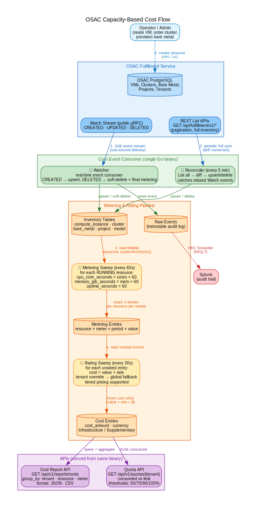
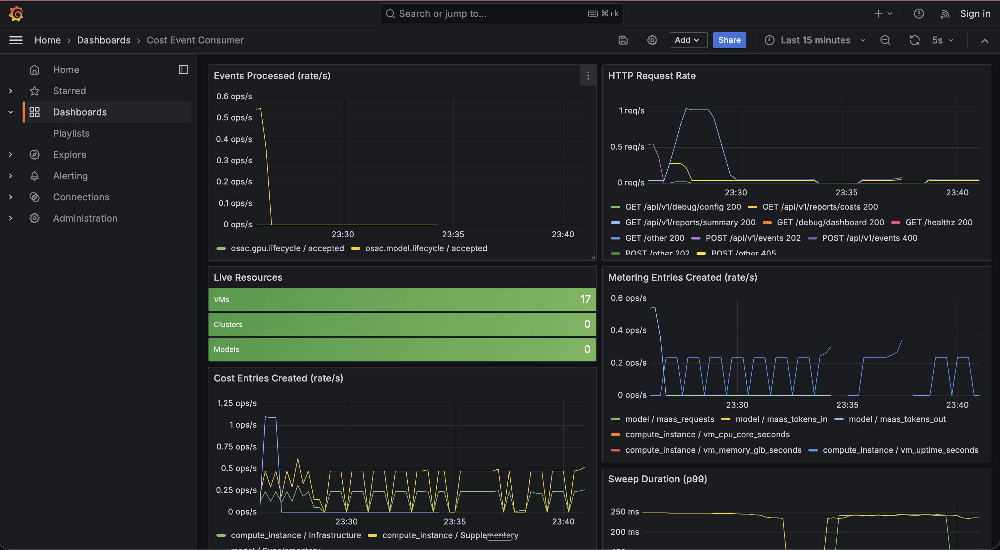
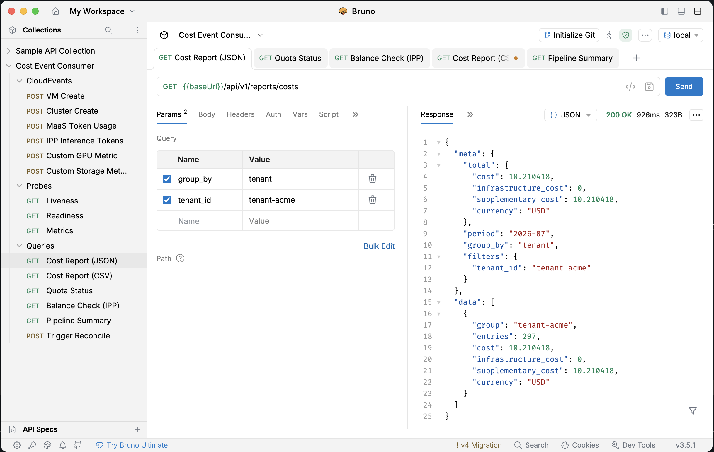

<!-- _class: lead -->

# Cost Event Consumer — Project Overview
## 2026-07-15

Martin Povolny

<!--
Narration: This presentation covers the full Cost Event Consumer project —
a Go service that integrates with OSAC fulfillment-service for capacity-based
and consumption-based cost tracking. We'll walk through the architecture,
what we built, and what's proven.
-->

---

## OSAC Capacity-Based Cost Flow

<a href="osac-capacity-flow.svg" target="_blank"></a>

- Operator creates resource in OSAC (VM, cluster, bare metal)
- **Watch stream** delivers events in sub-second
- **Reconciler** periodically syncs full inventory (drift correction)
- **Metering sweep** (60s): RUNNING resources → usage entries
- **Rating sweep** (30s): usage × rate = dollar cost
- **Audit trail** forwarded to Splunk via HEC

<!--
Narration: This is the core pipeline. An operator creates a resource in OSAC —
a VM, cluster, or bare metal instance. The Watch stream delivers events in
sub-second to our Watcher, which stores them in inventory. Every 60 seconds
the metering sweep reads all RUNNING resources and produces usage entries —
CPU core-seconds, memory GiB-seconds, uptime. Every 30 seconds the rating
sweep multiplies usage by rates to produce dollar costs. The raw event log
is forwarded to Splunk via HEC for audit.
-->

---

## MaaS End-to-End: IPP Integration

<a href="maas-ipp-flow.svg" target="_blank"></a>

Full inference metering pipeline on local k3d:

- **Istio 1.29.2** + IPP ext_proc + llm-katan (echo LLM)
- Balance check on every request → `hasAccess: true/false`
- Usage report: CloudEvent → metering → cost
- Drop-in replacement for OpenMeter — same endpoints

<!--
Narration: This is the consumption-based side — MaaS token metering.
The IPP external-metering plugin in the OSAC AI gateway calls our
checkBalance and reportUsage endpoints. On every inference request,
we check the tenant's budget. On every response, we receive a
CloudEvent with token counts and feed it through the same metering
and rating pipeline. Verified against the upstream IPP source code
and OpenAPI spec.
-->

---

## Live Demos (Recordings)

**Demo 1 — Full Pipeline: Inventory, Metering, Cost, Quotas**
[Watch on Google Drive](https://drive.google.com/file/d/1gagbe1-VhpyYVi4K8x1IA1mjLSEZZli0/view?usp=drive_link)

> Create a VM in OSAC → Watch stream delivers event → inventory sync → metering sweep → rating sweep → dollar cost → quota check. All in real-time.

**Demo 2 — Live Dashboard: MaaS + Real-Time Cost Pipeline**
[Watch on Google Drive](https://drive.google.com/file/d/1CW9TgRR0yHV5AEC4g1Y3AMex3s9fWJzZ/view?usp=drive_link)

> Dashboard auto-refreshing at 1s. Per-tenant rate overrides, MaaS burst traffic, VM delete with final metering, CSV export.

<!--
Narration: We have two recorded demos available. Demo 1 shows the full
pipeline end-to-end from the terminal — creating a VM in OSAC and watching
cost entries appear. Demo 3 shows the same pipeline through the live
dashboard with MaaS traffic, per-tenant pricing, and CSV export.
-->

---

## What Was Implemented — 12 done / 5 partial / 1 TBD of 18 requirements

| Area | Description |
|---|---|
| **OSAC integration** | Watch stream + reconciler, 10 entity types |
| **Capacity-based metering** | VMs, clusters, bare metal — provisioned resources × time |
| **MaaS token metering** | IPP integration, 850 req/s proven |
| **Rating engine** | Tiered pricing, per-tenant rate overrides |
| **Custom metric extraction** | Config-driven, zero code changes for new resource types |
| **Quota/budget API** | Real-time balance, threshold checks (50/70/90/100%) |
| **Cost reporting** | JSON + CSV, group by tenant/resource/meter |
| **Bare metal costing** | Inventory + uptime metering |
| **Audit trail** | Immutable raw events + Splunk HEC forwarding |
| **Observability** | Prometheus metrics, structured logging, K8s probes, graceful shutdown |
| **CI pipeline** | 6 jobs incl. k3s + k3d integration tests |
| **Tooling** | Bruno collection, Grafana dashboard, debug dashboard |
| **Adversarial review** | 4 rounds, 72 findings, 46 fixed, 0 critical/high open |
| **Stress test** | 850 req/s sustained, 40K+ requests, zero errors |

<!--
Narration: Here's everything we built. The core is OSAC integration with
capacity-based and consumption-based metering. On top of that: a rating
engine with tiered pricing and per-tenant overrides, custom metric
extraction that handles new resource types with zero code changes,
quota and reporting APIs, bare metal costing, audit trail forwarding
to Splunk, full observability, CI with two integration test suites,
and developer tooling. Four rounds of adversarial review with zero
critical or high findings open, and the stress test proved 850 req/s
sustained. 12 of 18 requirements are done.
-->

---

## Built-in Debug Dashboard

<a href="screenshots/cost-debug-dash-1.png" target="_blank"></a>

- Real-time cost summary across tenants
- Infrastructure vs Supplementary split
- Group by tenant, resource type, meter, resource
- Environment tab: OSAC connection, DB, intervals
- Served from the binary — no separate tool

<!--
Narration: The built-in dashboard shows the pipeline in action — cost
split across tenants, Infrastructure vs Supplementary classification.
The Environment tab shows OSAC connection, database (credentials masked),
processing intervals. All served from the binary itself.
-->

---

## Observability: Prometheus Metrics + Grafana

<a href="screenshots/grafana-dash-3.png" target="_blank"></a>

- Counters: events, metering entries, cost entries
- Histograms: sweep duration (metering 60s, rating 30s)
- Gauges: live compute instances
- Separate `:9000` port (no auth) — Koku pattern
- Grafana dashboard auto-provisioned via `docker compose`

<!--
Narration: Prometheus metrics on a separate port without auth so
Prometheus can scrape without a JWT — same pattern as Koku. Counters
for events, metering entries, cost entries. Histograms for sweep
duration. The Grafana dashboard is pre-provisioned and auto-refreshing.
-->

---

## Observability: Logging & Probes

**Structured JSON logging** for OpenShift log aggregation:
```json
{
  "time": "2026-07-06T18:05:33Z",
  "level": "INFO",
  "msg": "http request",
  "method": "POST",
  "path": "/api/v1/events",
  "status": 202,
  "duration_ms": 3,
  "request_id": "a1b2c3d4"
}
```

**Kubernetes probes** (auth-exempt):
- `/healthz` → liveness (always 200)
- `/readyz` → readiness (pings DB, returns 503 if down)

**Graceful shutdown** with 30s drain + panic recovery on all goroutines.

<!--
Narration: LOG_FORMAT=json for production. Every request gets a request
ID. Probe endpoints are exempt from JWT auth so Kubernetes can reach
them. Graceful shutdown drains in-flight requests. If a goroutine panics,
the error propagates to the errgroup and the pod restarts.
-->

---

## CI Pipeline + Integration Tests

<a href="screenshots/integration-test-osac-in-k3s.png" target="_blank"></a>

**CI (every PR):** lint, build, test, links, container

**Integration test 1 — OSAC on k3s:**
- Full OSAC + cost stack deployed in CI
- Creates resources, sends CloudEvents
- Verifies: probes, metrics, cost entries, quota API

**Integration test 2 — MaaS/IPP on k3d:**
- Istio + IPP ext_proc + echo LLM + cost consumer
- Balance check + usage reporting end-to-end
- 850 req/s sustained, zero errors

<!--
Narration: Every PR runs 6 CI jobs. Integration test 1 deploys the full
OSAC stack on k3s — gRPC, REST gateway, OIDC mock, two PostgreSQL
instances, and our consumer — then runs 12 end-to-end checks.
Integration test 2 deploys the MaaS pipeline on k3d — Istio, IPP
external-metering plugin, echo LLM, and our consumer — and verifies
balance checks and usage reporting at load.
-->

---

## Custom Metrics

OSAC will emit new CloudEvent types over time:
- GPU workloads, storage volumes, network traffic, ...
- Each with different fields to meter

Without custom metrics: **every new metric = code change + PR + deploy**

With custom metrics: **drop a JSON config, restart** → rating, reporting, quotas all work automatically

`CUSTOM_METRICS_CONFIG=deploy/custom-metrics-example.json`

<!--
Narration: This is the most important functional feature we added.
OSAC is evolving — new resource types, new metrics. Without custom
metrics, every new dimension means a code change. With it, an operator
drops a JSON config file and the system meters it automatically. No
code changes, no recompile, no redeploy.
-->

---

## Custom Metrics: How It Works

<div class="columns">
<div>

**CloudEvent in:**
```json
{
  "type": "osac.gpu.lifecycle",
  "data": {
    "instance_id": "gpu-i-abc123",
    "tenant_id": "tenant-acme",
    "gpu_model": "A100",
    "gpu_memory_gib_seconds": 245760.0,
    "gpu_compute_seconds": 3600.0,
    "duration_seconds": 3600,
    "state": "RUNNING"
  }
}
```

</div>
<div>

**Config that extracts meters:**
```json
{
  "event_type": "osac.gpu.lifecycle",
  "resource_type": "gpu_instance",
  "resource_id_field": "instance_id",
  "tenant_id_field": "tenant_id",
  "meters": [
    { "meter_name":
        "gpu_memory_gib_seconds",
      "value_field":
        "gpu_memory_gib_seconds",
      "unit": "gib_seconds" },
    { "meter_name":
        "gpu_compute_seconds",
      "value_field":
        "gpu_compute_seconds",
      "unit": "seconds" }
  ]
}
```

</div>
</div>

Rating, reporting, quotas — all work automatically. No code changes.

<!--
Narration: Left side is the CloudEvent that arrives. Right side is the
config that tells the system which fields to extract as meters. The
field names in the config point at the field names in the event data.
Rating, reporting, and quotas all work on free-text meter names — so
custom metrics flow through the entire pipeline with zero code changes.
-->

---

## Bruno: Clickable CloudEvent Catalog

<a href="screenshots/bruno-cost.png" target="_blank"></a>

Committed to git — no cloud, no accounts.

- 6 CloudEvent types (VM, Cluster, MaaS, IPP, GPU, Storage)
- Cost report with editable query params
- Quota status, balance check, reconcile trigger
- Docs tab with valid parameter values
- Response: $10.21 cost for tenant-acme

<!--
Narration: Bruno is a local HTTP client like Postman but file-based —
the collection is committed to git. Each request has documentation with
valid parameter values. Click to fire, see the response. Great for demos
and for developers exploring the API.
-->

---

## What's Next

| Item | Status | Next step |
|---|---|---|
| MaaS tenant attribution | Researched | Confirm subscription → tenant mapping with OSAC |
| Project-level quotas | Tenant-only done | Add project quotas with rollup (Pau, PR #33) |
| gRPC Watch stream | PoC done ([PR #32](https://github.com/myersCody/cost_ai_grid_poc/pull/32)) | Clarify public vs private stream with OSAC |
| Catalog-item pricing | Rates done | Add SKU-based pricing layer (Pau, PR #33) |
| Performance | 850 req/s baseline | In-memory balance cache, report available |
| REQ-5 Chargeback export | API done | Scheduled export + FOCUS format |

<!--
Narration: The main open item is MaaS tenant attribution — we've
researched the IPP pipeline and found that TokenMetadata on the
MaaSSubscription CRD has the fields we need but they're not wired
through to the CloudEvent. Project-level quotas and catalog pricing
are new requirements from Pau's review. The gRPC Watch PoC is done
and tested — ready to switch if needed.
-->

---

## Spikes In Progress

| Spike | PR | What |
|---|---|---|
| **Koku integration** | [#44](https://github.com/myersCody/cost_ai_grid_poc/pull/44) | Sync cost-event-consumer data into Koku daily summary tables |
| **GoRules/Zen engine** | [#45](https://github.com/myersCody/cost_ai_grid_poc/pull/45) | Programmable rating rules — replace hardcoded rate logic |
| **FOCUS v1.0 export** | [#43](https://github.com/myersCody/cost_ai_grid_poc/pull/43) | Cost export in FinOps FOCUS standard format |

<!--
Narration: Three spikes are in progress. Koku integration explores how
to feed our cost data into Koku's existing daily summary tables — the
path to using Koku's reporting and UI. GoRules/Zen evaluates a
programmable rules engine for complex rating logic beyond flat and
tiered rates. FOCUS export adds a cost export endpoint in the FinOps
Foundation's standard format for interoperability with third-party
cost tools.
-->

---

<!-- _class: lead -->

# Questions?

Martin Povolny, mpovolny@redhat.com

[github.com/myersCody/cost_ai_grid_poc](https://github.com/myersCody/cost_ai_grid_poc)
