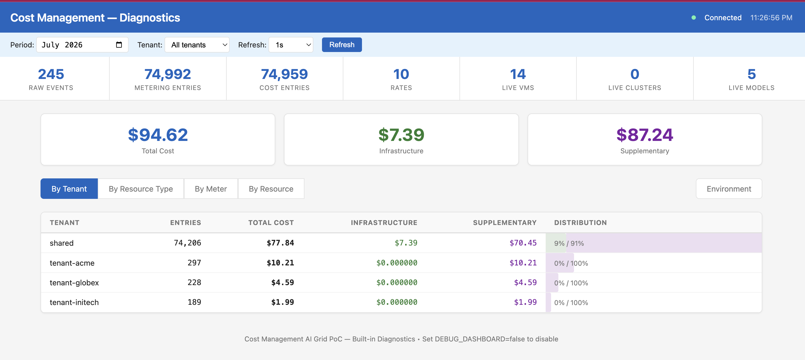
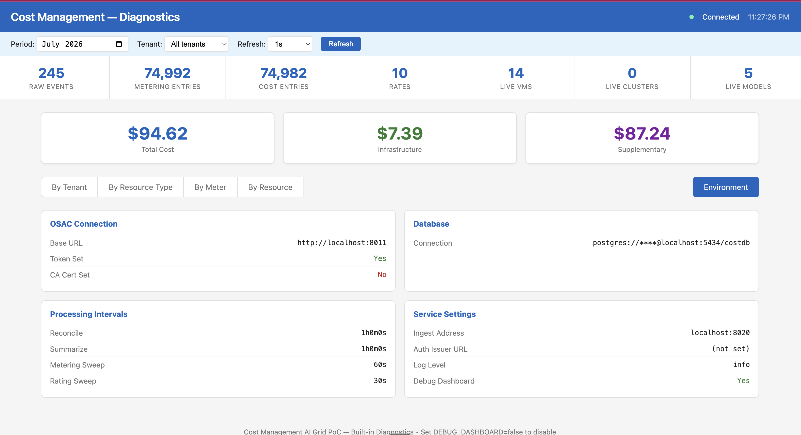
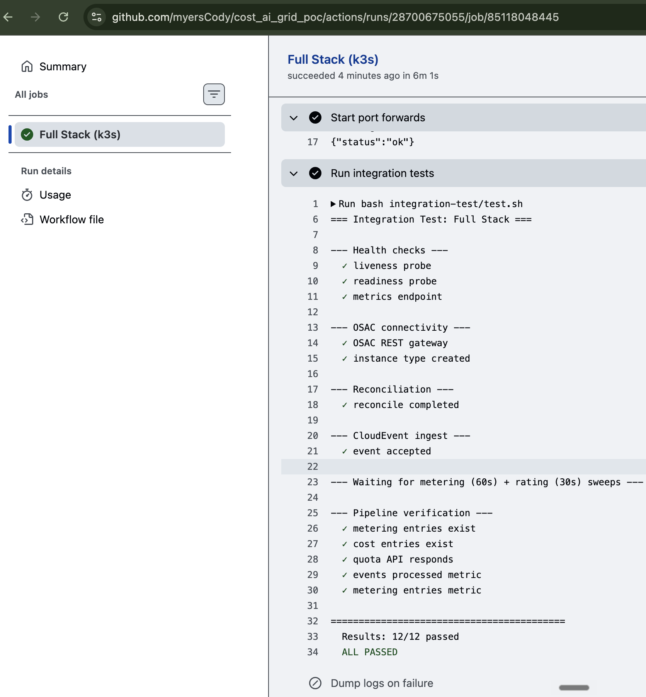
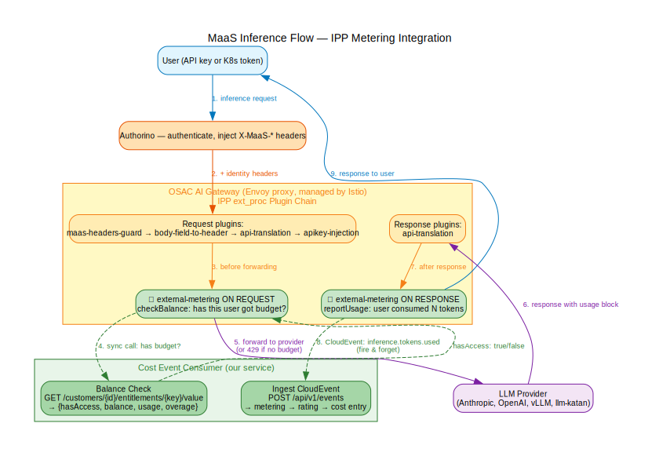
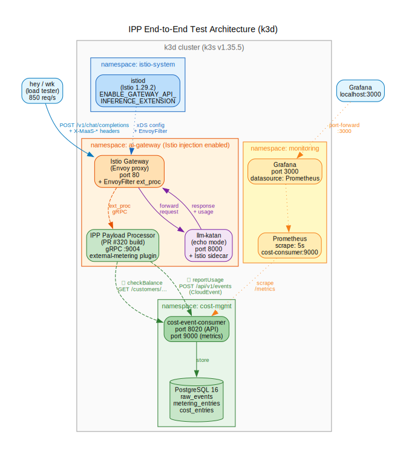

<!-- _class: lead -->

# Cost Event Consumer — Status Update
## 2026-07-07

Martin Povolny

<!--
Narration: Welcome. This is our fourth demo — covering everything we built
since the live dashboard demo on July 1. Focus areas: custom metric
extraction (REQ-13), observability stack, CI pipeline, integration testing,
and tooling.
-->

---

## What's New Since Demo 3

| Area | Status |
|---|---|
| **REQ-13** Custom metric extraction | <span class="done">Done</span> — config-driven, zero code changes |
| **Observability** P1+P2 | <span class="done">Done</span> — Prometheus, probes, logging, shutdown |
| **CI pipeline** | <span class="done">Done</span> — 6 jobs incl. k3s integration test |
| **OSAC integration test** | <span class="done">Done</span> — full OSAC + cost stack on k3s in CI |
| **MaaS integration test** | <span class="done">Done</span> — IPP + AI gateway + echo LLM on k3d |
| **Adversarial review** | v4 — 72 findings, 46 fixed, 0 critical/high open |
| **Tooling** | Bruno collection + Grafana dashboard |

**Score: 13 done / 4 partial / 1 TBD** (of 18 requirements, as of 2026-07-07)

<!--
Narration: Since demo 3 we shipped custom metrics, full observability,
a CI pipeline with integration testing, and developer tooling. 13 of 18
requirements are done.
-->

---

## REQ-13: Custom Metrics

OSAC will emit new CloudEvent types over time:
- GPU workloads, storage volumes, network traffic, ...
- Each with different fields to meter

Without REQ-13: **every new metric = code change + PR + deploy**

With REQ-13: **drop a JSON config, restart** → rating, reporting, quotas all work automatically

`CUSTOM_METRICS_CONFIG=deploy/custom-metrics-example.json`

<!--
Narration: This is the most important functional feature we added.
OSAC is evolving — new resource types, new metrics. Without REQ-13,
every new dimension means a code change. With it, an operator drops
a JSON config file and the system meters it automatically. No code
changes, no recompile, no redeploy.
-->

---

## REQ-13: How It Works

<div class="columns">
<div>

**CloudEvent in:**
```json
{
  "type": "osac.gpu.lifecycle",
  "data": {
    "instance_id": "gpu-i-abc123",
    "tenant_id": "tenant-acme",
    "gpu_model": "A100",
    "gpu_memory_gib_seconds": 245760.0,
    "gpu_compute_seconds": 3600.0,
    "duration_seconds": 3600,
    "state": "RUNNING"
  }
}
```

</div>
<div>

**Config that extracts meters:**
```json
{
  "event_type": "osac.gpu.lifecycle",
  "resource_type": "gpu_instance",
  "resource_id_field": "instance_id",
  "tenant_id_field": "tenant_id",
  "meters": [
    { "meter_name":
        "gpu_memory_gib_seconds",
      "value_field":
        "gpu_memory_gib_seconds",
      "unit": "gib_seconds" },
    { "meter_name":
        "gpu_compute_seconds",
      "value_field":
        "gpu_compute_seconds",
      "unit": "seconds" }
  ]
}
```

</div>
</div>

Rating, reporting, quotas — all work automatically. No code changes.

<!--
Narration: Left side is the CloudEvent that arrives. Right side is the
config that tells the system which fields to extract as meters. The
field names in the config point at the field names in the event data.
Rating, reporting, and quotas all work on free-text meter names — so
custom metrics flow through the entire pipeline with zero code changes.
-->

---

## Built-in Debug Dashboard

<a href="screenshots/cost-debug-dash-1.png" target="_blank"></a>

- Real-time cost summary
- **$94.62** total across 4 tenants
- Infrastructure vs Supplementary split
- Group by tenant, resource type, meter, resource
- 74,992 metering entries → 74,959 cost entries

<!--
Narration: The built-in dashboard shows the pipeline in action. $94.62
in total cost, split across 4 tenants. The "shared" tenant has both
infrastructure ($7.39 from VMs) and supplementary ($70.45 from MaaS
tokens). Each tenant's cost is isolated.
-->

---

## Debug Dashboard: Environment

<a href="screenshots/cost-debug-dash-2.png" target="_blank"></a>

- OSAC connection status
- Database connection (credentials masked)
- Processing intervals: reconcile 1h, metering 60s, rating 30s
- Service settings: auth, log level, ports

<!--
Narration: The Environment tab shows operational config. OSAC connection
URL, database (credentials masked), processing intervals, auth status.
This is served from the binary itself — no separate tool needed.
-->

---

## Observability: Grafana Dashboard

<a href="screenshots/grafana-dash-3.png" target="_blank"></a>

`docker compose up -d` → `http://localhost:3000`

- 17 live VMs from OSAC
- Event throughput + HTTP request rate
- Metering and cost entry creation rates
- Sweep duration p99
- Auto-provisioned, auto-refreshing

<!--
Narration: The Grafana dashboard scrapes our Prometheus metrics on port
9000. You can see 17 live VMs, metering entries being created for both
compute instances and MaaS tokens, cost entries flowing from the rating
sweep. This starts with docker compose up — dashboard is pre-provisioned.
-->

---

## Observability: Metrics Detail

| Metric | Type | What |
|---|---|---|
| `events_processed_total` | Counter | Events by type + status |
| `metering_entries_created_total` | Counter | Meters by resource + name |
| `cost_entries_created_total` | Counter | Costs by type |
| `metering_sweep_duration_seconds` | Histogram | 60s sweep latency |
| `rating_sweep_duration_seconds` | Histogram | 30s sweep latency |
| `live_compute_instances` | Gauge | Active VMs |
| `http_requests_total` | Counter | API traffic |

Separate `:9000` port (no auth) — RHT pattern from Koku.

<!--
Narration: All metrics use the cost_consumer_ namespace. Counters for
events, metering entries, cost entries. Histograms for sweep duration.
Gauges for live resources. Served on a separate port without auth so
Prometheus can scrape without a JWT.
-->

---

## Observability: Logging & Probes

**Structured JSON logging** for OpenShift log aggregation:
```json
{
  "time": "2026-07-06T18:05:33Z",
  "level": "INFO",
  "msg": "http request",
  "method": "POST",
  "path": "/api/v1/events",
  "status": 202,
  "duration_ms": 3,
  "request_id": "a1b2c3d4"
}
```

**Kubernetes probes** (auth-exempt):
- `/healthz` → liveness (always 200)
- `/readyz` → readiness (pings DB, returns 503 if down)

**Graceful shutdown** with 30s drain + panic recovery on all goroutines.

<!--
Narration: LOG_FORMAT=json for production. Every request gets a request
ID. Probe endpoints are exempt from JWT auth so Kubernetes can reach
them. Graceful shutdown drains in-flight requests. If a goroutine panics,
the error propagates to the errgroup and the pod restarts.
-->

---

## CI Pipeline + Integration Test

<a href="screenshots/integration-test-osac-in-k3s.png" target="_blank"></a>

**CI (every PR):** lint, build, test, links, container

**Integration test (k3s):**
- Deploys full OSAC + cost stack
- Creates resources in OSAC
- Sends CloudEvents
- Waits for metering + rating sweeps
- Verifies: probes, metrics, cost entries, quota API

<!--
Narration: Every PR runs 6 CI jobs. The integration test deploys the
full stack — OSAC gRPC, REST gateway, OIDC mock, two PostgreSQL
instances, and our consumer — on k3s in GitHub Actions. Then it runs
12 end-to-end checks. All green.
-->

---

## Bruno: Clickable CloudEvent Catalog

<a href="screenshots/bruno-cost.png" target="_blank"></a>

Committed to git — no cloud, no accounts.

- 6 CloudEvent types (VM, Cluster, MaaS, IPP, GPU, Storage)
- Cost report with editable query params
- Quota status, balance check, reconcile trigger
- Docs tab with valid parameter values
- Response: $10.21 cost for tenant-acme

<!--
Narration: Bruno is a local HTTP client like Postman but file-based —
the collection is committed to git. Each request has documentation with
valid parameter values. Click to fire, see the response. Great for demos
and for developers exploring the API.
-->

---

## Adversarial Review Process

| Version | Scope | Total | Fixed | Accepted |
|---|---|---|---|---|
| v1 | Full codebase | 17 | 9 | 4 |
| v2 | Observability | +16 = 33 | +10 = 19 | +0 = 4 |
| v3 | Custom metrics | +8 = 41 | +3 = 22 | +4 = 8 |
| v4 | Full re-audit | +31 = 72 | +24 = 46 | +8 = 16 |

0 critical, 0 high open. 14 remaining (medium/low).
Key v4 fixes: batch project_id, concurrent reconciliation guard,
duration validation, readiness probe, rating N+1, configurable intervals.

<!--
Narration: Four rounds of adversarial review. 72 total findings, 46
fixed, 16 accepted as known PoC limitations. Zero critical or high
severity open. The 14 remaining are medium and low — none blocking.
-->

---

## MaaS End-to-End: IPP Integration Verified

<a href="maas-ipp-flow.svg" target="_blank"></a>

Full inference metering pipeline on local k3d:

- **Istio 1.29.2** + IPP ext_proc (PR #320) + llm-katan (echo LLM)
- Balance check on every request → `hasAccess: true/false`
- Usage report: CloudEvent → metering → cost
- [Setup guide](https://github.com/myersCody/cost_ai_grid_poc/blob/main/docs/dev/k3d-ipp-deployment.md) · [IPP overview](https://github.com/myersCody/cost_ai_grid_poc/blob/main/docs/research/ipp-overview.md) · [MaaS flow](https://github.com/myersCody/cost_ai_grid_poc/blob/main/docs/maas-flow.md)

<!--
Narration: We deployed the full OSAC AI gateway stack locally and proved
that our cost consumer works as a drop-in replacement for OpenMeter.
The IPP plugin calls our checkBalance and reportUsage endpoints — both
verified against the upstream source code and OpenAPI spec.
-->

---

## IPP Stress Test: 850 req/s, Zero Errors

<a href="k3d-test-stack.svg" target="_blank"></a>

| Test | Concurrency | RPS | P50 | P99 |
|------|-------------|-----|-----|-----|
| Baseline | 10 | **803** | 12ms | 23ms |
| High | 50 | **860** | 55ms | 91ms |
| Sustained 30s | 20 | **848** | 23ms | 43ms |

40K+ requests, 100% success. Unique constraint costs 6-11% throughput.
[Full report](https://github.com/myersCody/cost_ai_grid_poc/blob/main/docs/dev/ipp-stress-test-2026-07-05.md) · [PR #25](https://github.com/myersCody/cost_ai_grid_poc/pull/25)

<!--
Narration: We hammered the pipeline with 40,000 requests at up to 100
concurrent connections. 850 requests per second sustained, zero failures.
Balance check averages 0.36ms, usage report 2.17ms. This is on a local
k3d cluster running on ARM Mac via QEMU — production would be faster.
-->

---

## What's Next

| Item | Status | Next step |
|---|---|---|
| MaaS tenant attribution | Researched | Confirm subscription → tenant mapping with OSAC |
| Project-level quotas | Tenant-only done | Add project quotas with rollup (Pau, PR #33) |
| gRPC Watch stream | PoC done ([PR #32](https://github.com/myersCody/cost_ai_grid_poc/pull/32)) | Clarify public vs private stream with OSAC |
| Catalog-item pricing | Rates done | Add SKU-based pricing layer (Pau, PR #33) |
| Performance | 850 req/s baseline | In-memory balance cache, report available |
| REQ-5 Chargeback export | API done | Scheduled export + FOCUS format |

<!--
Narration: The main open item is MaaS tenant attribution — we've
researched the IPP pipeline and found that TokenMetadata on the
MaaSSubscription CRD has the fields we need but they're not wired
through to the CloudEvent. Project-level quotas and catalog pricing
are new requirements from Pau's review. The gRPC Watch PoC is done
and tested — ready to switch if needed.
-->

---

<!-- _class: lead -->

# Questions?

Martin Povolny, mpovolny@redhat.com

[github.com/myersCody/cost_ai_grid_poc](https://github.com/myersCody/cost_ai_grid_poc)
