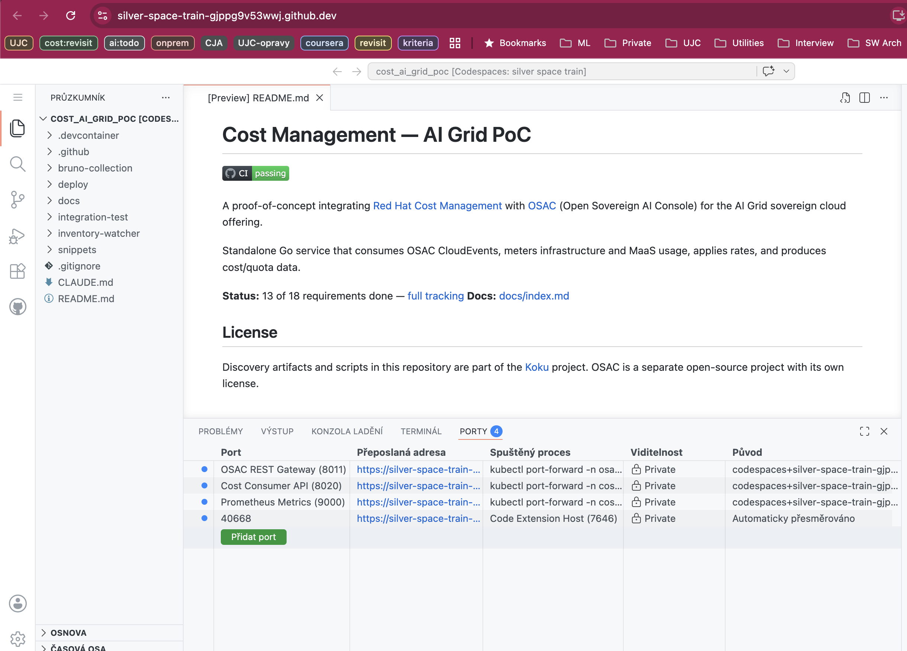
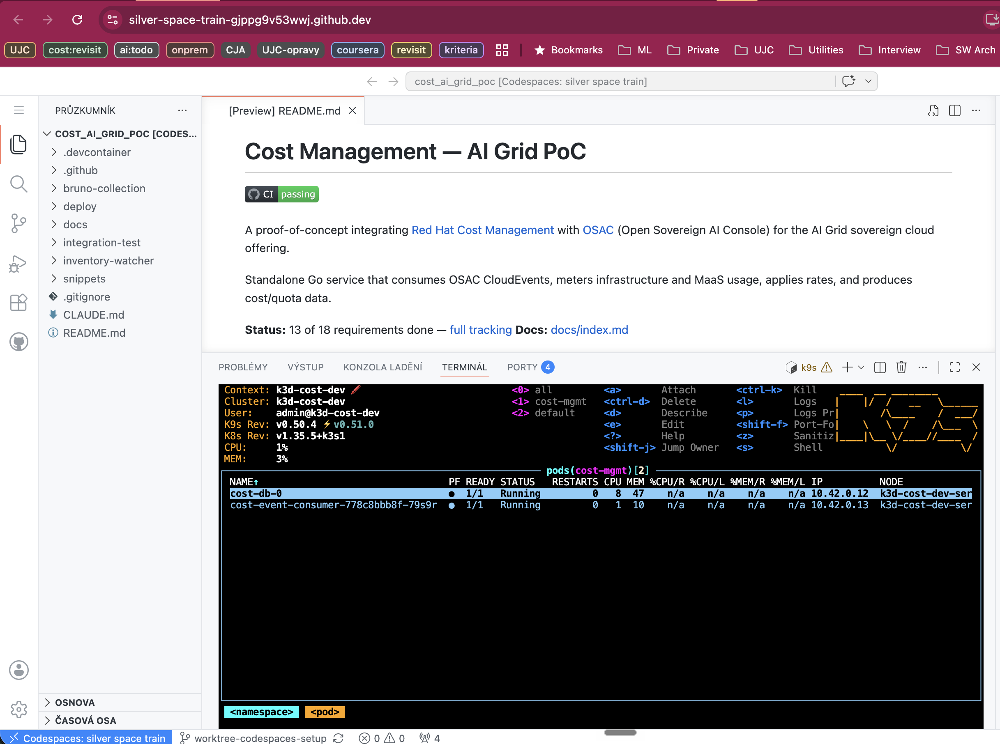

# Development Environment Setup

Documentation for running the cost-event-consumer in different environments.

## Quick Start

**For CRC (OpenShift Local):**
1. Start here: [`crc-deployment-checklist.md`](crc-deployment-checklist.md)
2. Reference: [`crc-full-deployment.md`](crc-full-deployment.md)

**For local development:**
1. Follow: [`local-dev-setup.md`](local-dev-setup.md)

**For GitHub Codespaces (zero-install, browser-based):**
1. Click "Code → Codespaces → Create codespace on main" on GitHub
2. Wait ~3 min for the environment to build (k3d cluster starts automatically)
3. Run `bash .devcontainer/deploy-stack.sh` to deploy the full OSAC + consumer stack
4. Run `bash integration-test/test.sh` to verify

## Documents

| File | Purpose | Audience |
|------|---------|----------|
| **crc-deployment-checklist.md** | Quick checklist for CRC deployment | **START HERE** for colleagues deploying to CRC |
| **crc-full-deployment.md** | Complete step-by-step CRC deployment | Reference for detailed steps |
| **crc-osac-deployment.md** | OSAC-specific details and troubleshooting | When debugging OSAC issues |
| **local-dev-setup.md** | Local development (Docker + native binaries) | Developers working on the code |
| **[`.devcontainer/`](../../.devcontainer/)** | GitHub Codespaces config (k3d, k9s, Claude Code) | Zero-install browser-based dev |

## Deployment Options

### Option 1: CRC (OpenShift Local) - Recommended for Testing

**Pros:**
- Production-like environment (OpenShift)
- Tests full Kubernetes deployment
- CloudNativePG handles migrations correctly
- Full OSAC stack with proper TLS

**Cons:**
- Requires 12GB+ RAM for CRC
- ~45 min initial setup
- Slower iteration (need to rebuild/push images)

**When to use:** Integration testing, demo preparation, OpenShift-specific features

**Timeline:** ~45 minutes first time, ~20 minutes subsequent deployments

### Option 2: GitHub Codespaces - Recommended for Quick Start

**Pros:**
- Zero local setup (runs in browser or via `gh codespace ssh`)
- Full k3s cluster (k3d) with kubectl, k9s, helm pre-installed
- Claude Code CLI available out of the box
- Same integration tests as CI

**Cons:**
- Requires GitHub Codespaces access (paid)
- Higher latency than local dev
- 4-core machine minimum recommended

**When to use:** Onboarding, demos, quick integration testing without local setup

**Timeline:** ~3 min environment build + ~5 min stack deploy

**How to start:**
```bash
# From GitHub UI: Code → Codespaces → Create codespace
# Or from CLI (use whichever fork/upstream you work from):
gh codespace create --repo myersCody/cost_ai_grid_poc --machine premiumLinux
```

Once inside the codespace, deploy and test:
```bash
bash .devcontainer/deploy-stack.sh    # deploy OSAC + consumer (~5 min)
bash integration-test/test.sh         # run integration tests
k9s                                   # browse cluster
```




### Option 3: Local Development - Recommended for Coding

**Pros:**
- Fast iteration (rebuild in seconds)
- Simple debugging (attach debugger)
- Minimal resource usage
- Quick startup

**Cons:**
- Not production-like
- Manual service management (multiple terminals)
- Doesn't test Kubernetes-specific features

**When to use:** Active development, debugging, quick testing

**Timeline:** ~10 minutes setup

## Components

Both setups deploy:

1. **OSAC fulfillment-service**
   - gRPC API (port 8010)
   - REST gateway (port 8011 local, 8000 CRC)
   - OIDC server (port 8013)
   - PostgreSQL (port 5433 local, managed by CNPG in CRC)

2. **cost-event-consumer** (our tool)
   - HTTP API (port 8020)
   - Metrics (port 9000)
   - PostgreSQL (port 5434 local, cost-db in CRC)

## Common Workflows

### Deploying Changes to CRC

```bash
# 1. Build new image
cd inventory-watcher
docker build -t quay.io/martin_povolny/cost-event-consumer:latest -f Containerfile .

# 2. Push to registry
docker push quay.io/martin_povolny/cost-event-consumer:latest

# 3. Restart pods to pull new image
kubectl delete pod -n cost-mgmt -l app=cost-event-consumer
```

### Running Tests

```bash
# Local
cd inventory-watcher
go test ./...

# E2E test (local)
SKIP_METERING=1 bash snippets/test-inventory-watcher.sh

# CRC verification
bash snippets/test-crc-deployment.sh
```

### Checking Logs

```bash
# CRC
kubectl logs -n cost-mgmt -l app=cost-event-consumer --tail=50 -f

# Local
# Check the terminal where inventory-watcher is running
```

## Troubleshooting

### CRC Issues

**Pods not starting:**
```bash
kubectl describe pod -n <namespace> <pod-name>
kubectl logs -n <namespace> <pod-name>
```

**OSAC migrations dirty:**
- Use CloudNativePG (not plain postgres)
- See `crc-osac-deployment.md`

**Resource exhausted:**
```bash
crc config set memory 16384
crc config set cpus 6
crc stop && crc start
```

### Local Development Issues

**OSAC not reachable:**
```bash
# Check if OSAC services are running
lsof -i :8010  # gRPC
lsof -i :8011  # REST
lsof -i :8013  # OIDC
```

**Database connection refused:**
```bash
# Check PostgreSQL containers
docker ps | grep postgres
docker logs osac-db
docker logs cost-db
```

## Getting Help

1. Check the relevant guide (CRC vs local)
2. Check troubleshooting sections
3. Review pod logs / container logs
4. Check this repo's Git history for recent changes
5. Ask in team chat with:
   - What you're trying to do
   - What error you're seeing
   - Output of verification commands

## Quick Reference

### CRC Commands
```bash
# Status
kubectl get pods --all-namespaces | grep -E "osac|cost-mgmt|postgres"

# Logs
kubectl logs -n cost-mgmt -l app=cost-event-consumer --tail=20

# Restart
kubectl delete pod -n cost-mgmt -l app=cost-event-consumer
```

### Local Commands
```bash
# Start databases
docker start osac-db cost-db

# Check services
lsof -i :8010,8011,8013,8020

# Test OSAC
curl -s http://localhost:8011/api/fulfillment/v1/clusters \
  -H "Authorization: Bearer $(cat /tmp/osac_token.txt)" | jq
```

## Next Steps After Setup

1. **Generate OSAC token** (both environments need this for auth)
2. **Create test data** in OSAC (clusters, compute instances)
3. **Run demo scenario** (see `snippets/test-inventory-watcher.sh`)
4. **Verify metering** (check consumer database for usage records)
