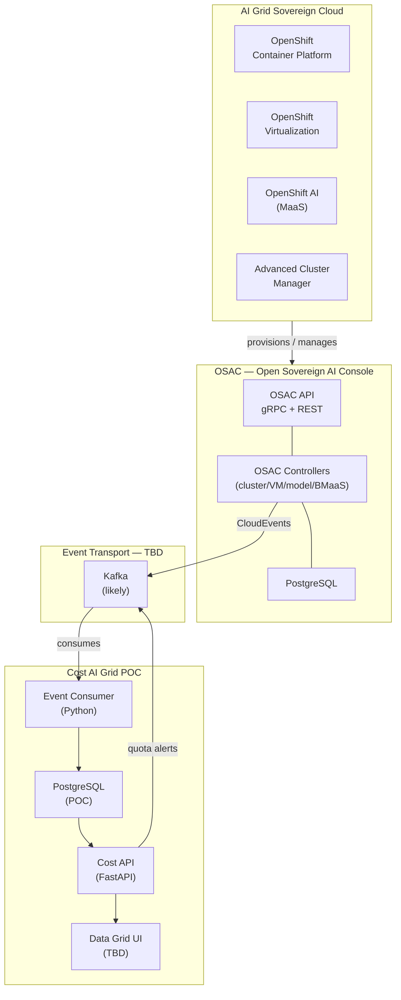
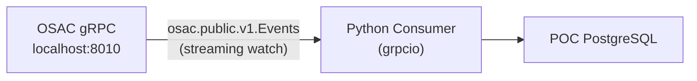
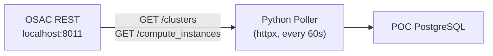
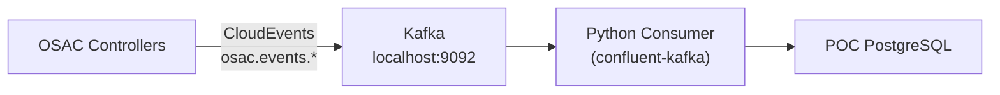

# Cost Management for AI Grid — Architecture

> **Status:** POC (Proof of Concept)
> **Goal:** A PoC-quality Cost Management on-premise instance integrated with OSAC for the AI Grid sovereign cloud blueprint.

---

## 1. Background

The **AI Grid** is a sovereign cloud offering for customers, built on the Red Hat portfolio (OpenShift Container Platform, OpenShift Virtualization, OpenShift AI, Advanced Cluster Manager, Ansible Automation Platform).

**OSAC** (Open Sovereign AI Console) is the orchestrator: it provisions resources (clusters, VMs, models, bare metal), exposes a unified API, and emits/receives events and alerts. See: [osac-project on GitHub](https://github.com/osac-project).

**Cost Management** must integrate with OSAC to:
- Synchronize inventory (clusters, VMs, models, bare metal)
- Receive CloudEvents for resource lifecycle (replacing the Cost Management Metrics Operator)
- Perform capacity-based metering for CaaS/VMaaS
- Perform consumption-based metering for MaaS
- Manage budgets/quotas and emit threshold alerts back to OSAC

This POC explores that integration from the Cost Management side.

---

## 2. System Context



---

## 3. Local Development Service Map

When running the full stack locally, services are assigned ports to avoid conflicts between Koku and OSAC:

| Service | Port | Notes |
|---|---|---|
| Koku API | 8000 | Existing |
| Koku masu | 5042 | Existing |
| Koku PostgreSQL | 15432 | Existing |
| OSAC gRPC | 8010 | |
| OSAC REST gateway | 8011 | `/api/fulfillment/v1/` |
| OSAC metrics | 8012 | |
| OSAC OIDC server | 8013 | Local JWT signing |
| OSAC PostgreSQL | 5433 | |
| **POC Kafka** | **9092** | docker-compose |
| **POC PostgreSQL** | **5434** | docker-compose |
| **POC FastAPI** | **8020** | This POC |

---

## 4. OSAC Resource Model

OSAC organizes resources in a hierarchy:

```
Tenant
  └── Project
        └── Resource
              ├── Cluster (CaaS — HCP / OCP)
              ├── ComputeInstance (VMaaS — OpenShift Virtualization)
              ├── Model (MaaS — OpenShift AI)
              └── BareMetalInstance (BMaaS — RHEL / Windows)
```

The OSAC fulfillment service exposes these via gRPC (`osac.public.v1`) with a REST gateway:

| gRPC Service | REST Endpoint |
|---|---|
| `osac.public.v1.ClusterTemplates` | `GET /api/fulfillment/v1/cluster_templates` |
| `osac.public.v1.Clusters` | `GET /api/fulfillment/v1/clusters` |
| `osac.public.v1.ClusterOrders` | `GET /api/fulfillment/v1/cluster_orders` |
| `osac.public.v1.Events` | gRPC streaming watch API |

---

## 5. Event Ingestion — Options

The OSAC fulfillment service currently exposes a gRPC streaming `Events` service and a REST polling API. The production target is native CloudEvents over Kafka. Three ingestion options are viable for the POC:

### Option A — gRPC Watch (simplest for POC)



**Pros:** No additional infrastructure, works today against local OSAC.
**Cons:** Tightly coupled to gRPC; not the production target; requires TLS cert + JWT auth.

### Option B — REST Polling (fallback)



**Pros:** Simple; matches the existing CaaS/VMaaS collector scripts.
**Cons:** Snapshot-based; misses events between polls; 60s granularity.

### Option C — Kafka (production target)



**Pros:** Decoupled; matches production architecture; supports all event types.
**Cons:** Requires OSAC to publish to Kafka (not fully implemented on OSAC side yet); needs Kafka running locally.

### Recommendation

Start with **Option B** (REST polling) to unblock POC development while OSAC and Cost agree on the Kafka transport. Implement **Option C** once the Kafka topic schema is agreed. Keep the consumer logic behind an interface so the transport layer is swappable.

---

## 6. Metering Model

Cost Management must support three billing models:

| Resource Type | Metering | Unit |
|---|---|---|
| Cluster (CaaS) | Capacity-based | cluster-month |
| VM (VMaaS) | Capacity-based | VM-month |
| Model (MaaS) | Consumption-based | per-million-tokens, per-million-requests |
| Bare Metal (BMaaS) | TBD | TBD |

### Capacity-Based (CaaS / VMaaS)

Charge is based on what was provisioned, not what was used. The key metrics are:
- **Control plane uptime**: `SUM(duration_seconds)` where `host_type = _control_plane`
- **Worker node time**: `SUM(worker_node_seconds)` grouped by `host_type`
- **Peak worker count**: `MAX(node_count)` per cluster per `host_type`

### Consumption-Based (MaaS)

Charge is based on actual usage:
- Tokens in / tokens out / inference tokens
- Number of requests
- Per-million-token or per-million-request rates (tiered)

---

## 7. Data Flow

### Inventory Sync

```
OSAC REST API
  GET /cluster_templates  →  populate cluster_templates table
  GET /clusters           →  populate clusters table
  GET /cluster_orders     →  populate cluster_orders table
  (repeated on each event or on schedule)
```

### Metering Pipeline

```
CloudEvent received (Kafka or gRPC or REST poll)
  │
  ├── validate & parse (Pydantic model)
  ├── persist raw event → events table
  ├── update resource state → clusters / compute_instances table
  ├── calculate metering increment → metering_entries table
  └── evaluate quota thresholds → if breached → emit alert
```

### Alert Flow

```
quota_consumption > threshold (e.g. 70%)
  │
  └── emit CloudEvent → Kafka topic: osac.alerts.quota
        │
        └── OSAC receives alert → applies OPA rate limit policy
```

---

## 8. Component Architecture (POC)

```
cost_ai_grid_poc/
├── docker-compose.yml        # Kafka (KRaft) + POC PostgreSQL
├── pyproject.toml            # uv-managed Python deps
├── .env.example              # config template
│
├── consumer/                 # Event ingestion layer
│   ├── main.py               # entry point: Kafka consumer or REST poller
│   ├── models.py             # Pydantic CloudEvent models
│   ├── transport/
│   │   ├── kafka_consumer.py # Option C: Kafka
│   │   ├── grpc_watcher.py   # Option A: gRPC stream
│   │   └── rest_poller.py    # Option B: REST poll
│   └── handlers/
│       ├── inventory.py      # sync clusters/VMs into DB
│       ├── metering.py       # calculate metering entries
│       ├── cost_tracker.py   # apply rates → cost entries
│       └── alerting.py       # evaluate quotas → emit alerts
│
└── api/                      # FastAPI REST API
    ├── main.py
    └── routers/
        ├── events.py         # GET /events
        ├── inventory.py      # GET /clusters, /vms, /models
        ├── costs.py          # GET /costs, /metering
        ├── reports.py        # GET /reports
        └── quotas.py         # GET/POST /quotas, /budgets
```

---

## 9. Technology Stack

| Layer | Choice | Rationale |
|---|---|---|
| Language | Python | Koku is Python; reuse patterns and team knowledge |
| Event format | CloudEvents 1.0 | OSAC standard; spec-driven |
| Event transport | Kafka (KRaft, no Zookeeper) | Production target; decoupled |
| Storage | PostgreSQL | Matches OSAC and Koku; team familiarity |
| API | FastAPI | Async, built-in OpenAPI docs |
| ORM | SQLAlchemy + Alembic | Standard in Koku ecosystem |
| Kafka client | confluent-kafka | Most production-ready Python Kafka client |
| gRPC client | grpcio + grpcio-tools | For Option A / direct gRPC watch |
| HTTP client | httpx | Async; for REST polling and OSAC API calls |
| Package mgmt | uv + pyproject.toml | Modern, fast; matches fulfillment-service style |
| Auth | PyJWT + cryptography | Mint JWTs from local `server.key` for OSAC API |

---

## 10. Open Questions

| # | Question | Owner | Status |
|---|---|---|---|
| 1 | What transport will OSAC use to send CloudEvents to Cost? (Kafka? HTTP?) | OSAC + Cost | Open |
| 2 | What Kafka topic names will OSAC use? | OSAC | Open |
| 3 | Will OSAC define CloudEvents for MaaS and BMaaS? | OSAC | Open |
| 4 | Where do quotas/budgets live — OSAC, Cost, or both? | OSAC + Cost | Open |
| 5 | Where do cost tiers live — OSAC, Cost, or both? | OSAC + Cost | Open |
| 6 | How will quota alerts be communicated to OSAC? (Kafka CloudEvents? HTTP callback?) | OSAC + Cost | Open |
| 7 | Does OSAC have a concept of projects within tenants that Cost needs to track? | OSAC + Cost | Open |
| 8 | UI requirements for the data grid? | Cost | TBD |

---

## 11. References

- [OSAC Project GitHub](https://github.com/osac-project)
- [OSAC Fulfillment Service](https://github.com/osac-project/fulfillment-service)
- [OSAC Metering Discover POC](https://github.com/masayag/osac-metering-discover-poc)
- [OSAC Console Mockups](https://heyethankim.github.io/osac-demo/)
- [docs/development/fullfillment_service_setup.md](../development/fullfillment_service_setup.md) — local dev setup guide
- [docs/requirements/ai_grid_poc_requirements_brief.md](../requirements/ai_grid_poc_requirements_brief.md) — requirements spike
