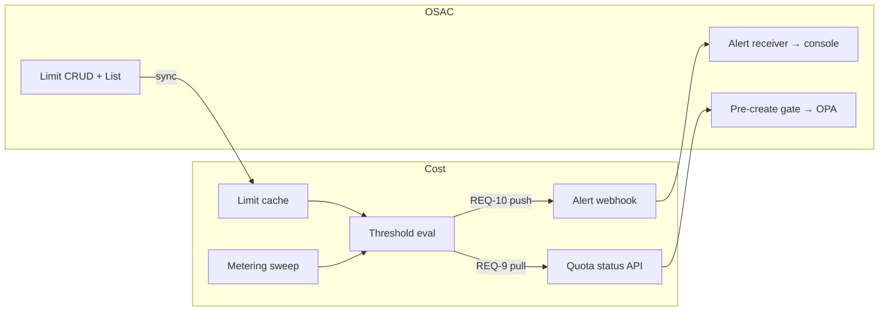
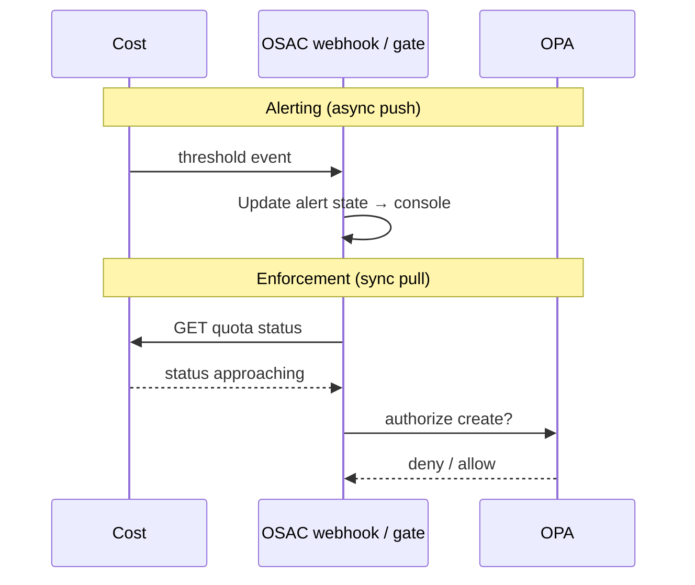

# Cost Management ↔ OSAC Quota Integration

> **Status:** Draft — for OSAC team review (options & ownership)
> **Requirements:** REQ-9 (quota/budget status API), REQ-10 (threshold notifications); requirements brief §3–§5
> **Related:** [architecture.md](../architecture.md), [alerting-spec-draft.md](alerting-spec-draft.md) (wire formats — after route chosen)

---

## Summary

Cost meters consumption; OSAC defines limits and enforces them via OPA. One threshold-evaluation step in Cost can feed two downstream paths:

| Path | REQ | Mechanism | Use |
|---|---|---|---|
| **Alerting** | REQ-10 | Cost **pushes** threshold events | Console banners, tenant notifications |
| **Enforcement** | REQ-9 | OSAC **pulls** quota status at create time | OPA deny/throttle, pre-create gate |

**Leaning toward (for review):** OSAC owns limits; Cost owns consumption and threshold evaluation; use **push and pull together** — push for async alerts (~90s latency OK), pull for synchronous create gates.

**Out of scope (PoC):** Cost UI for alert history; grace-period logic in Cost; email/Slack/PagerDuty (OSAC owns user-facing notifications); Kafka as default transport.

---

## Ownership

| Concern | Owner | Notes |
|---|---|---|
| Limit / budget CRUD | **OSAC** | Source of truth for `limit_value`, period, scope |
| Limit sync into Cost | **Cost** (consumer) | Read-only cache; reconciler + optional Watch |
| Metering & consumption | **Cost** | Aggregates usage from inventory + metering sweeps |
| Threshold evaluation | **Cost** | Runs after each sweep; fires/resolves alert state |
| Alert delivery (REQ-10) | **Cost** (emitter) → **OSAC** (receiver) | Push transport TBD — see options |
| Quota status API (REQ-9) | **Cost** (provider) → **OSAC** (consumer) | Precomputed status for gates |
| Enforcement (OPA, throttle, deny) | **OSAC** | Uses pull status and/or cached alert state |
| User notifications (email, Slack) | **OSAC** | Separate from enforcement path |

**Concepts:**

| Term | Consumption source | Example limit |
|---|---|---|
| **Quota** | Meter usage for period | 10,000 CPU core-seconds / month |
| **Budget** | Cost amount for period | $5,000 USD / month |

Scope: **tenant** (required), optional **project**, specific meter or budget.

---

## OSAC gaps today

> **Source:** [fulfillment-service](https://github.com/osac-project/fulfillment-service) — verified against local clone at `../osac/fulfillment-service` (June 2026).

OSAC has eventing and OPA authorization, but no quota/cost alerting platform:

| Existing capability | Relevant? |
|---|---|
| PostgreSQL NOTIFY + `Events.Watch` | Partial — OSAC → Cost lifecycle only |
| Resource `status.state` | Partial — operational health, not quota |
| Embedded OPA (`authz.rego`) | No — RBAC only; no consumption evaluation |
| `notifications` table | No — short-lived NOTIFY relay (~1 min TTL) |

**Net-new on OSAC side:**

| Gap | Why it matters |
|---|---|
| Quota / Budget resources + List API | Cost cannot sync limits |
| Inbound alert webhook | Cost cannot deliver REQ-10 push |
| Alert state store + OPA quota rules | Console warnings, throttle/deny |
| Pre-create gate calling Cost pull API | Synchronous enforcement |

**Why two transports:** `Events.Watch` delivery is best-effort. Push (~90s after usage crosses a threshold) is fine for notifications but not for create-time gates — those must pull sub-second precomputed status.

---

## Architecture options

### Option 1 — Push + pull *(recommended for v1)*

Cost pushes threshold events to OSAC; OSAC syncs limits via List API; OSAC pulls status at create time.

| | |
|---|---|
| **Pros** | Proactive console warnings; reliable create gates; clear separation of async vs sync paths |
| **Cons** | Most OSAC build (webhook, state store, OPA rules); two integrations to maintain |
| **Cost owns** | Evaluation, push emitter, pull API, limit cache sync |
| **OSAC owns** | Limit CRUD, webhook receiver, alert state, OPA enforcement, pre-create gate |
| **PoC fit** | v1 target after PoC demo |

### Option 2 — Pull-only

OSAC polls Cost status API; no push from Cost.

| | |
|---|---|
| **Pros** | Smallest integration surface; no webhook or alert receiver on OSAC |
| **Cons** | No proactive warning until something polls; console banners need OSAC-side polling |
| **Cost owns** | Evaluation, pull API, limit cache sync |
| **OSAC owns** | Limit CRUD, polling loop or gate-time pull, OPA enforcement |
| **PoC fit** | Good interim stepping stone |

### Option 3 — OPA live query on create

OPA calls Cost directly on each create (no cached alert state for gates).

| | |
|---|---|
| **Pros** | Always fresh at gate time; no OSAC alert state store required for enforcement |
| **Cons** | Latency and load on every create; Cost must be highly available on critical path |
| **Cost owns** | On-demand status endpoint |
| **OSAC owns** | OPA policy wiring, create-path integration |
| **PoC fit** | Combine with Option 1 for hard gates if push latency is insufficient |

### Option 4 — Mock limits *(PoC demo now)*

Cost seeds limits locally; OSAC stub webhook; prove pull API end-to-end without OSAC List API.

| | |
|---|---|
| **Pros** | Unblocks Cost PoC immediately; minimal OSAC dependency |
| **Cons** | Not production-shaped; limits not owned by OSAC yet |
| **Cost owns** | Mock limits, evaluation, pull API, optional stub push |
| **OSAC owns** | Stub webhook only (optional) |
| **PoC fit** | **Now** |

### Rejected approaches

| Approach | Why rejected |
|---|---|
| **OSAC evaluates thresholds** | Duplicates Cost aggregation; two systems can disagree on `consumed_value` |
| **Kafka event bus** | Operational overhead; no OSAC Kafka consumer today — see [ADR-002](../../decisions/002-arguments-against-kafka.md) |

**Suggested rollout:**

1. **PoC** — Option 4: mock limits, pull API, optional stub webhook.
2. **v1** — Option 1: OSAC List API + alert receiver + OPA rules.
3. **Hardening** — Option 3 on create path if any gate needs fresher than cached push state.

---

## What OSAC needs to build

High-level components — detail deferred until an option is chosen ([alerting-spec-draft.md](alerting-spec-draft.md)).

| # | Component | Owner |
|---|---|---|
| 1 | **Limit resources** — Quota / Budget CRUD, tenant/project scoped | OSAC |
| 2 | **Limit List API** — Cost sync source | OSAC |
| 3 | **Alert webhook** — receive threshold events from Cost | OSAC |
| 4 | **Alert state store** — consumed %, status, firing history | OSAC |
| 5 | **OPA extension** — deny/throttle from status or alert state | OSAC |
| 6 | **Pre-create gate** — pull Cost status before provisioning APIs | OSAC |

**Production follow-ups (not PoC):** Limit Watch events; console quota banners; optional ack endpoint; grace period on tenant policy; tenant email/Slack.

---

## Cross-cutting constraints

These apply regardless of which transport option is chosen.

### Threshold policy

Cost computes `consumed_pct = consumed / limit × 100` after each metering sweep ([ADR-001](../../decisions/001-metering-sweep-interval.md), ~60s interval).

| Level | Threshold | Alerting (REQ-10) | Enforcement (REQ-9) |
|---|---|---|---|
| Warning | 50% | Log / console banner | Usually none |
| Approaching | 70% | Warn tenant admin | Soft rate limit (OPA) |
| Critical | 90% | Notify tenant admin | Aggressive throttle |
| Exceeded | 100% | Escalate | Block new provisioning |

**Behavior (proposed):** Fire once per threshold per period; upgrade monotonically (70 → 90 → 100); resolve with ~5% hysteresis (e.g. fire at ≥70%, resolve at <65%).

**Open:** Whether thresholds live on the OSAC limit object or only in Cost — PoC may use Cost defaults.

### Latency budget

| Stage | Target |
|---|---|
| OSAC usage event | ≤30s after state change |
| Cost metering sweep | ≤60s |
| Evaluation + emit | ≤5s after sweep |
| **End-to-end detection** | **≤~90s** |

Push path targets this budget. Create gates must use pull, not push.

---

## End-to-end flows

**1 — Threshold crossed (push):** Usage accumulates → metering sweep → evaluator crosses 70% → Cost notifies OSAC → console banner.

**2 — Pre-create gate (pull):** User requests cluster → OSAC pulls quota status → exceeded at 102% → OPA denies create.

**3 — Resolve:** Resources deleted → consumption drops → hysteresis resolve → OSAC clears warning, OPA relaxes.

**4 — Period rollover:** Old-period alerts resolved; new period counters reset.

---

## Open questions

| # | Question | Impact |
|---|---|---|
| 1 | List API paths and resource shape (Quota vs Limit)? | Limit sync blocker |
| 2 | Limit Watch events or reconciler-only for v1? | Sync latency |
| 3 | Thresholds on OSAC limit object or Cost-only? | Policy ownership |
| 4 | Project-scoped limits in v1? | Aggregation keys |
| 5 | Alert webhook path and auth? | Push transport |
| 6 | OPA inputs — raw event or normalized struct? | Payload mapping |
| 7 | Alert acknowledged back to Cost? | Retry semantics |
| 8 | Grace period at 100% or 100% + N hours? | Enforcement semantics |
| 9 | MaaS token quotas — same event type? | Event taxonomy |
| 10 | Confirm Option 1 (push + pull) vs interim pull-only? | v1 scope |

---

## References

- [alerting-spec-draft.md](alerting-spec-draft.md) — API schemas, data model, implementation plan *(after route chosen)*
- [architecture.md](../architecture.md) — system context
- [data-model.md](../data-model.md) — planned `quotas`, `alerts` tables
- [event-types.md](../event-types.md) — CloudEvent taxonomy
- [ADR-001: Metering sweep interval](../../decisions/001-metering-sweep-interval.md)
- [ADR-002: Watch stream instead of Kafka](../../decisions/002-arguments-against-kafka.md)
- [Requirements overview — REQ-9, REQ-10](../../requirements/poc_requirements_overview.md#req-9-quotabudget-status-api)
