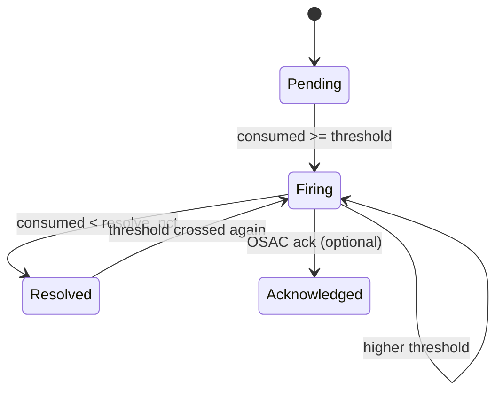

# Cost ↔ OSAC Quota Integration — Technical Spec (Draft)

> **Status:** Draft — **deferred** until architecture option is chosen
> **Parent:** [alerting-osac-integration.md](alerting-osac-integration.md) — options, ownership, constraints
> **Related:** [data-model.md](../../data-model.md), [event-types.md](../event-types.md)

Do not treat this as agreed contract. Wire formats, paths, and schema details here are starting points for implementation once Option 1 (or another route) is confirmed.

---

## Limit sync — OSAC → Cost

Same pattern as inventory: **periodic reconciler** (5–15 min + startup) + optional **Watch** events (`Quota`/`Budget` CREATED/UPDATED/DELETED). Reconciler alone is sufficient for PoC.

> **Proposed** — paths and shape to confirm with OSAC.

| Method | Endpoint |
|---|---|
| `GET` | `/api/fulfillment/v1/quotas`, `/quotas/{id}` |
| `GET` | `/api/fulfillment/v1/budgets`, `/budgets/{id}` |

Auth: Bearer JWT (same as other fulfillment List endpoints).

**Quota resource shape:**

```json
{
  "id": "019ec123-abcd-1234-abcd-ef5678901234",
  "metadata": {
    "name": "monthly-cpu-quota",
    "tenant": "tenant-acme",
    "creation_timestamp": "2026-06-01T00:00:00Z"
  },
  "spec": {
    "project_id": "019eb257-8108-773f-99c4-5d7642e9e7d8",
    "resource_type": "compute_instance",
    "meter_name": "vm_cpu_core_seconds",
    "limit_value": 10000.0,
    "unit": "core_seconds",
    "period": "monthly",
    "effective_from": "2026-06-01T00:00:00Z",
    "effective_to": null,
    "thresholds": [50, 70, 90, 100]
  },
  "status": { "state": "QUOTA_STATE_ACTIVE" }
}
```

Budgets: same pattern with `limit_value` + `currency` instead of `meter_name` / `unit`.

**Cost cache (`quotas` table):** read-only mirror keyed by `external_id` (OSAC UUID). Cost must not expose limit CRUD in PoC.

| Condition | Cost behavior |
|---|---|
| Limit not synced | Skip evaluation; log warning |
| Limit deleted in OSAC | Soft-delete cache row; resolve firing alerts |
| Limit updated | Overwrite on next sync; re-evaluate next sweep |
| Sync lag | Acceptable within reconciler interval |

---

## Alert lifecycle (REQ-10)



| State | Cost action | OSAC |
|---|---|---|
| `pending` | None | None |
| `firing` | POST CloudEvent | Banner / notify; OPA may throttle |
| `resolved` | POST CloudEvent `state: resolved` | Clear warnings; relax OPA |
| `acknowledged` | Stop retries | — |

Local state: `alerts` table — see [data-model.md](../../data-model.md). Optional `alert_rules` for per-quota thresholds.

---

## Outbound CloudEvent — `cost.quota.threshold.v1`

Same CloudEvents 1.0 envelope as [event-types.md](../event-types.md), with:

- `type`: `cost.quota.threshold.v1`
- `source`: `cost.management.alerting`
- `subject`: `tenant_id`
- `id`: stable hash of `(quota_id, threshold_pct, period_start, state)` for dedup

**Delivery:**

```
POST {OSAC_ALERT_WEBHOOK_URL}
Content-Type: application/cloudevents+json
Authorization: Bearer {service_account_token}
```

Cost retries with exponential backoff (max 5 attempts); `2xx` and duplicate `ce-id` = success. OPA may consume push events to refresh bundles but **must not rely on push alone** for create gates.

**`data` payload:**

| Field | Required | Notes |
|---|---|---|
| `state`, `limit_kind`, `tenant_id`, `quota_id` | yes | `state`: `firing`, `resolved`, `acknowledged` |
| `threshold_pct`, `threshold_level`, `consumed_*`, `limit_value` | yes | `threshold_level`: `warning`, `approaching`, `critical`, `exceeded` |
| `period`, `period_start`, `period_end` | yes | ISO8601 |
| `project_id`, `meter_name`, `resource_type`, `unit`, `currency` | nullable | Quota: meter fields set; budget: `currency` set, meter fields null |

Resolved events use the same schema with `"state": "resolved"` and `consumed_pct` below the resolve bound.

**Example (`data`, quota `firing`):**

```json
{
  "state": "firing",
  "limit_kind": "quota",
  "tenant_id": "tenant-acme",
  "project_id": "019eb257-8108-773f-99c4-5d7642e9e7d8",
  "quota_id": "019ec123-abcd-1234-abcd-ef5678901234",
  "resource_type": "compute_instance",
  "meter_name": "vm_cpu_core_seconds",
  "period": "monthly",
  "period_start": "2026-06-01T00:00:00Z",
  "period_end": "2026-06-30T23:59:59Z",
  "threshold_pct": 70.0,
  "threshold_level": "approaching",
  "consumed_value": 7200.0,
  "limit_value": 10000.0,
  "consumed_pct": 72.0,
  "unit": "core_seconds",
  "currency": null
}
```

**Budget delta:** same type; `limit_kind: "budget"`, `meter_name` / `resource_type` / `unit` null, `currency` required (e.g. `"USD"`).

---

## Pull API — quota/budget status (REQ-9)

Read-only, idempotent, sub-second. Not an alerting channel.

```
GET /api/cost/v1/tenants/{tenant_id}/quota-status
```

> **Current implementation:** `GET /api/v1/quotas/{tenant_id}` (see [api-reference.md](../../api-reference.md))

Query params: `project_id`, `meter_name`, `limit_kind` (`quota` | `budget` | both).

Single-quota shortcut for OPA: `GET .../tenants/{tenant_id}/quotas/{quota_id}/status` → one object or `404`.

Auth: Bearer JWT; OSAC service account needs `cost:quota:read`.

**Response:**

```json
{
  "tenant_id": "tenant-acme",
  "evaluated_at": "2026-06-25T18:01:05Z",
  "quotas": [{
    "quota_id": "019ec123-abcd-1234-abcd-ef5678901234",
    "limit_kind": "quota",
    "meter_name": "vm_cpu_core_seconds",
    "period": "monthly",
    "period_start": "2026-06-01T00:00:00Z",
    "period_end": "2026-06-30T23:59:59Z",
    "limit_value": 10000.0,
    "consumed_value": 7200.0,
    "consumed_pct": 72.0,
    "unit": "core_seconds",
    "status": "approaching",
    "highest_threshold_fired": 70.0,
    "within_limit": true
  }],
  "budgets": [{
    "quota_id": "019ec123-abcd-1234-abcd-ef5678901235",
    "limit_kind": "budget",
    "consumed_pct": 70.0,
    "currency": "USD",
    "status": "approaching",
    "within_limit": true
  }]
}
```

| `status` | Condition |
|---|---|
| `ok` | Below 50% |
| `warning` | ≥50%, <70% |
| `approaching` | ≥70%, <90% |
| `critical` | ≥90%, <100% |
| `exceeded` | ≥100% |

`within_limit` = `consumed_pct < 100`. Grace periods are applied by OSAC at enforce time, not Cost.

---

## Schema extensions

See [data-model.md](../../data-model.md). Additions:

**`quotas` cache:** `external_id`, `synced_at`, `deleted_at` — populated only by OSAC sync job.

**`alert_rules`** (planned, not built): `quota_id`, `threshold_pct`, `threshold_level`, `resolve_pct` (default `threshold_pct - 5`), `enabled`.

**`alerts`** (planned schema above; actual is simpler): `id`, `tenant_id`, `meter_name`, `threshold_pct`, `consumed`, `limit_value`, `period`, `state`, `fired_at`. No `limit_kind`, `project_id`, `delivery_status`, `delivery_attempts`, or `ce_id` — thresholds are hardcoded at 50/70/90/100% in `rating.go`.

---

## Evaluation pseudocode

```
[metering sweep completes]
  → aggregate consumption per (tenant, project?, meter_name, period)
  → for each active cached limit:
      → consumed_pct = consumed / limit × 100
      → update alerts table (hysteresis rules above)
      → if state changed: POST CloudEvent (REQ-10)
      → status visible via pull API (REQ-9)
```

Quota aggregation:

```sql
SELECT COALESCE(SUM(value), 0)
FROM metering_entries
WHERE tenant_id = :tenant_id
  AND (project_id = :project_id OR :project_id IS NULL)
  AND meter_name = :meter_name
  AND period_start >= :period_start
  AND period_end   <= :period_end;
```

Budget: `SUM(cost_entries.cost_amount)` over the same window.

---

## PoC implementation plan

| Phase | Deliverable | Depends on |
|---|---|---|
| **P0** | OSAC limit List API (or mock) + Cost reconciler → `quotas` cache | API contract |
| **P1** | `alert_rules`; thresholds from OSAC spec or Cost defaults | P0 |
| **P2** | Quota evaluator (post-sweep) | P1 |
| **P3** | `alerts` lifecycle + hysteresis | P2 |
| **P4** | Pull API | P2 |
| **P5** | Push webhook emitter | P3, OSAC webhook URL |
| **P6** | Budget evaluation | `cost_entries` + rates |

Minimum demo: mock limit API + P0–P4 on `vm_cpu_core_seconds`.

---

## Testing

| Test | Assert |
|---|---|
| Fire at 70% | Alert row + CloudEvent after metering crosses threshold |
| No duplicate fires | Single `firing` delivery while held at 71% for 3 sweeps |
| Hysteresis | `resolved` event below 65% |
| Pull API | `consumed_value` matches `SUM(metering_entries)` |
| Webhook retry | 503 then 200 → eventual delivery |
| Limit sync | CRUD in OSAC reflected in Cost cache after reconciler |
| Period boundary | Counters reset on new period |

---

## References

- [alerting-osac-integration.md](alerting-osac-integration.md) — options & ownership
- [data-model.md](../../data-model.md)
- [event-types.md](../event-types.md)
- OSAC fulfillment-service — `database_notifier.go`, `events_server.go`, `authz.rego`, `event_type.proto`
