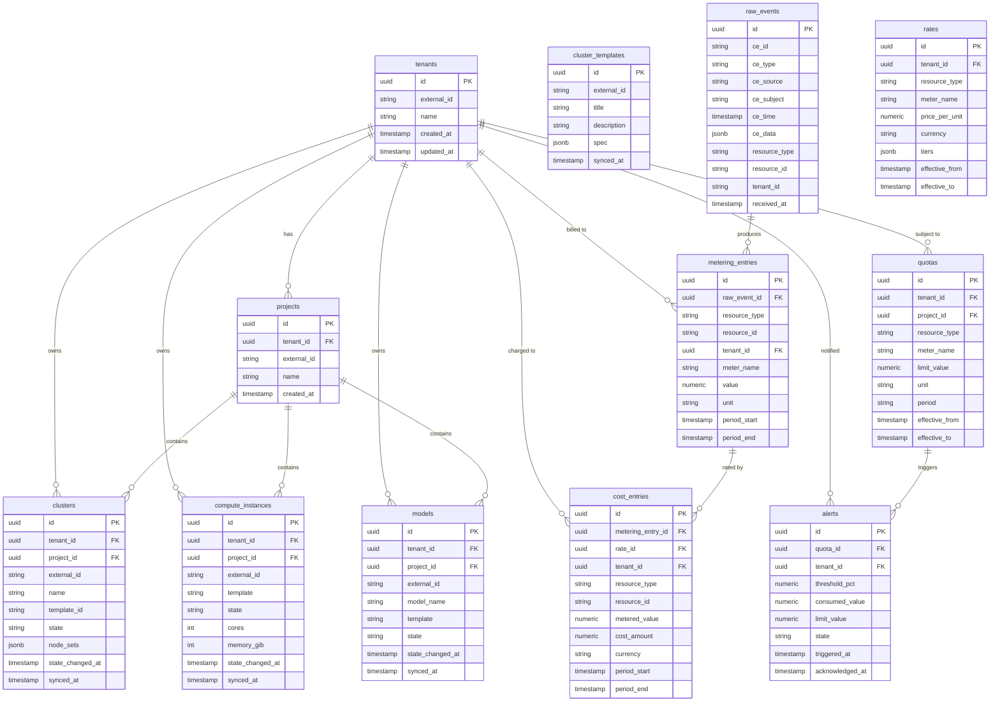

# Cost Management for AI Grid — Data Model

> **Status:** POC draft — schema will evolve as CloudEvent formats are finalized with OSAC.

---

## Overview

The POC PostgreSQL database (port `5434`) stores:
1. **Raw events** — immutable log of every CloudEvent received
2. **Inventory** — current state of OSAC resources (clusters, VMs, models, bare metal)
3. **Metering entries** — calculated usage increments per resource per interval
4. **Cost entries** — metering × rate = cost, per resource per period
5. **Quotas / budgets** — provider-defined limits per tenant/project
6. **Alerts** — threshold breach records

---

## Entity Relationship Diagram



---

## Table Definitions

### `tenants`

Tenant registry, synced from OSAC.

| Column | Type | Description |
|---|---|---|
| `id` | `UUID` PK | Internal UUID |
| `external_id` | `TEXT` UNIQUE | OSAC tenant ID |
| `name` | `TEXT` | Human-readable name |
| `created_at` | `TIMESTAMPTZ` | |
| `updated_at` | `TIMESTAMPTZ` | |

---

### `projects`

Sub-divisions within a tenant (OSAC concept; Koku does not have this today).

| Column | Type | Description |
|---|---|---|
| `id` | `UUID` PK | Internal UUID |
| `tenant_id` | `UUID` FK → `tenants` | Parent tenant |
| `external_id` | `TEXT` UNIQUE | OSAC project ID |
| `name` | `TEXT` | |
| `created_at` | `TIMESTAMPTZ` | |

---

### `cluster_templates`

Synced from `GET /api/fulfillment/v1/cluster_templates`. Defines available cluster flavors.

| Column | Type | Description |
|---|---|---|
| `id` | `UUID` PK | Internal UUID |
| `external_id` | `TEXT` UNIQUE | OSAC template ID (e.g. `osac.templates.ocp_ci_small`) |
| `title` | `TEXT` | Display name |
| `description` | `TEXT` | |
| `spec` | `JSONB` | Full template spec from OSAC |
| `synced_at` | `TIMESTAMPTZ` | Last sync from OSAC |

---

### `clusters`

Current state of each cluster, derived from inventory sync and event processing.

| Column | Type | Description |
|---|---|---|
| `id` | `UUID` PK | Internal UUID |
| `tenant_id` | `UUID` FK → `tenants` | |
| `project_id` | `UUID` FK → `projects` | Nullable — project may not be set |
| `external_id` | `TEXT` UNIQUE | OSAC cluster UUID |
| `name` | `TEXT` | |
| `template_id` | `TEXT` | Reference to `cluster_templates.external_id` |
| `state` | `TEXT` | Latest OSAC state (e.g. `CLUSTER_STATE_READY`) |
| `node_sets` | `JSONB` | Array of `{host_type, node_count}` |
| `state_changed_at` | `TIMESTAMPTZ` | When state last changed |
| `synced_at` | `TIMESTAMPTZ` | Last inventory sync |

---

### `compute_instances`

Current state of each VM (VMaaS).

| Column | Type | Description |
|---|---|---|
| `id` | `UUID` PK | Internal UUID |
| `tenant_id` | `UUID` FK → `tenants` | |
| `project_id` | `UUID` FK → `projects` | |
| `external_id` | `TEXT` UNIQUE | OSAC instance UUID |
| `template` | `TEXT` | VM template ID |
| `state` | `TEXT` | Latest OSAC state |
| `cores` | `INT` | vCPU count |
| `memory_gib` | `INT` | RAM in GiB |
| `state_changed_at` | `TIMESTAMPTZ` | |
| `synced_at` | `TIMESTAMPTZ` | |

---

### `models`

Current state of each model deployment (MaaS).

| Column | Type | Description |
|---|---|---|
| `id` | `UUID` PK | Internal UUID |
| `tenant_id` | `UUID` FK → `tenants` | |
| `project_id` | `UUID` FK → `projects` | |
| `external_id` | `TEXT` UNIQUE | OSAC model UUID |
| `model_name` | `TEXT` | Model identifier (e.g. `llama-3-8b`) |
| `template` | `TEXT` | MaaS template ID |
| `state` | `TEXT` | Model deployment state |
| `state_changed_at` | `TIMESTAMPTZ` | |
| `synced_at` | `TIMESTAMPTZ` | |

---

### `raw_events`

Immutable log of every CloudEvent received. Never updated after insert.

| Column | Type | Description |
|---|---|---|
| `id` | `UUID` PK | Internal UUID |
| `ce_id` | `TEXT` | CloudEvent `id` field (deduplicate on this) |
| `ce_type` | `TEXT` | CloudEvent `type` (e.g. `osac.cluster.lifecycle`) |
| `ce_source` | `TEXT` | CloudEvent `source` |
| `ce_subject` | `TEXT` | CloudEvent `subject` (tenant_id) |
| `ce_time` | `TIMESTAMPTZ` | CloudEvent `time` |
| `ce_data` | `JSONB` | CloudEvent `data` payload |
| `resource_type` | `TEXT` | Derived: `cluster`, `compute_instance`, `model`, `bare_metal` |
| `resource_id` | `TEXT` | Derived: resource UUID from `ce_data` |
| `tenant_id` | `TEXT` | Derived: from `ce_subject` / `ce_data.tenant_id` |
| `received_at` | `TIMESTAMPTZ` | Wall clock time when event was received |

**Index:** `UNIQUE(ce_id)` for deduplication.
**Partition:** Consider range partitioning by `ce_time` (monthly) for long-term retention.

---

### `metering_entries`

Calculated usage increments derived from raw events. One row per meter per event.

| Column | Type | Description |
|---|---|---|
| `id` | `UUID` PK | |
| `raw_event_id` | `UUID` FK → `raw_events` | Source event |
| `resource_type` | `TEXT` | `cluster`, `compute_instance`, `model`, `bare_metal` |
| `resource_id` | `TEXT` | Resource UUID |
| `tenant_id` | `UUID` FK → `tenants` | |
| `meter_name` | `TEXT` | e.g. `cluster_uptime_seconds`, `vm_cpu_core_seconds` |
| `value` | `NUMERIC` | Metered quantity |
| `unit` | `TEXT` | e.g. `seconds`, `core_seconds`, `gib_seconds`, `tokens` |
| `period_start` | `TIMESTAMPTZ` | `ce_time - duration_seconds` |
| `period_end` | `TIMESTAMPTZ` | `ce_time` |

---

### `rates`

Provider-defined rates for billing. Supports flat and tiered pricing.

| Column | Type | Description |
|---|---|---|
| `id` | `UUID` PK | |
| `tenant_id` | `UUID` FK → `tenants` | Nullable — null means global default |
| `resource_type` | `TEXT` | `cluster`, `compute_instance`, `model`, `bare_metal` |
| `meter_name` | `TEXT` | Meter this rate applies to |
| `price_per_unit` | `NUMERIC` | Flat rate price per unit |
| `currency` | `TEXT` | ISO 4217 (e.g. `USD`) |
| `tiers` | `JSONB` | Tiered pricing: `[{up_to, price_per_unit}, ...]` |
| `effective_from` | `TIMESTAMPTZ` | Rate validity start |
| `effective_to` | `TIMESTAMPTZ` | Rate validity end (null = no end) |

**Tiered pricing example:**
```json
[
  {"up_to": 20,   "price_per_unit": 0.00},
  {"up_to": 120,  "price_per_unit": 0.08},
  {"up_to": null, "price_per_unit": 0.07}
]
```

---

### `cost_entries`

Monetary cost derived by applying a rate to a metering entry.

| Column | Type | Description |
|---|---|---|
| `id` | `UUID` PK | |
| `metering_entry_id` | `UUID` FK → `metering_entries` | |
| `rate_id` | `UUID` FK → `rates` | Rate applied |
| `tenant_id` | `UUID` FK → `tenants` | |
| `resource_type` | `TEXT` | |
| `resource_id` | `TEXT` | |
| `metered_value` | `NUMERIC` | Quantity billed |
| `cost_amount` | `NUMERIC` | `metered_value × rate` |
| `currency` | `TEXT` | ISO 4217 |
| `period_start` | `TIMESTAMPTZ` | |
| `period_end` | `TIMESTAMPTZ` | |

---

### `quotas`

Provider-defined resource limits per tenant (and optionally per project).

| Column | Type | Description |
|---|---|---|
| `id` | `UUID` PK | |
| `tenant_id` | `UUID` FK → `tenants` | |
| `project_id` | `UUID` FK → `projects` | Nullable — tenant-level quota if null |
| `resource_type` | `TEXT` | e.g. `cluster`, `model` |
| `meter_name` | `TEXT` | Which meter this quota constrains |
| `limit_value` | `NUMERIC` | Maximum allowed quantity |
| `unit` | `TEXT` | Unit of the limit |
| `period` | `TEXT` | `daily`, `monthly`, `yearly` |
| `effective_from` | `TIMESTAMPTZ` | |
| `effective_to` | `TIMESTAMPTZ` | Nullable |

---

### `alerts`

Records of quota threshold breaches. Emitted back to OSAC via CloudEvent.

| Column | Type | Description |
|---|---|---|
| `id` | `UUID` PK | |
| `quota_id` | `UUID` FK → `quotas` | Which quota was breached |
| `tenant_id` | `UUID` FK → `tenants` | |
| `threshold_pct` | `NUMERIC` | Trigger threshold (e.g. `70.0`, `90.0`, `100.0`) |
| `consumed_value` | `NUMERIC` | Actual consumption at trigger time |
| `limit_value` | `NUMERIC` | Quota limit at trigger time |
| `state` | `TEXT` | `firing`, `acknowledged`, `resolved` |
| `triggered_at` | `TIMESTAMPTZ` | When alert was first generated |
| `acknowledged_at` | `TIMESTAMPTZ` | Nullable |

---

## Data Flow Through the Model

```
CloudEvent received
  │
  ├─► raw_events (insert, deduplicate on ce_id)
  │
  ├─► clusters / compute_instances / models (upsert state)
  │
  ├─► metering_entries (insert per meter per event)
  │         │
  │         └─► cost_entries (insert after rate lookup)
  │
  └─► quotas (query accumulated metering for tenant)
            │
            └─► alerts (insert if threshold crossed → emit CloudEvent)
```

---

## Indexes (Key)

```sql
-- Deduplication
CREATE UNIQUE INDEX ON raw_events (ce_id);

-- Event queries by tenant / time
CREATE INDEX ON raw_events (tenant_id, ce_time DESC);
CREATE INDEX ON raw_events (ce_type, ce_time DESC);

-- Metering aggregation
CREATE INDEX ON metering_entries (tenant_id, meter_name, period_start, period_end);
CREATE INDEX ON metering_entries (resource_id, meter_name);

-- Cost reporting
CREATE INDEX ON cost_entries (tenant_id, period_start, period_end);

-- Quota evaluation
CREATE INDEX ON quotas (tenant_id, resource_type, meter_name);
```

---

## References

- [docs/poc_architecture/architecture.md](architecture.md)
- [docs/poc_architecture/event-types.md](event-types.md)
- [CloudEvents Spec](https://cloudevents.io/)
- COST-6951 — Cost Tiers
- COST-7164 — MaaS Spike
