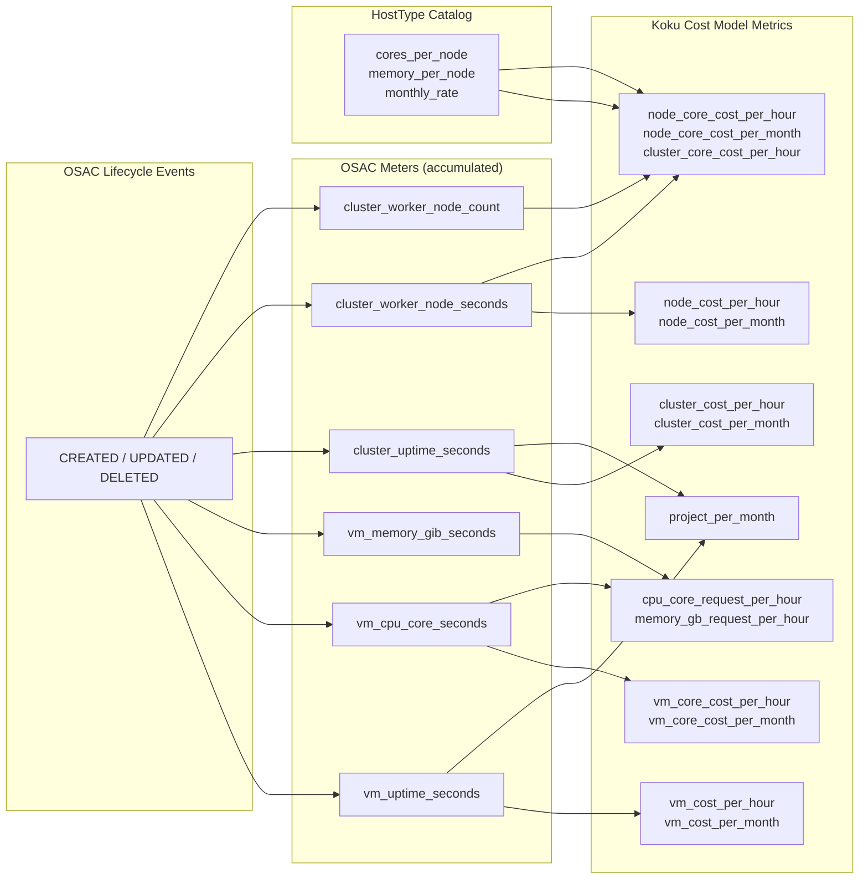

# Koku Cost Model Metrics: Feasibility with OSAC Metering

> **See also:** [metering-spec-draft.md](metering-spec-draft.md) — how metering is implemented for the PoC.

## What OSAC Metering Provides

From lifecycle events (CREATED/UPDATED/DELETED) on VMs, clusters, VNets, subnets, and IPs:

| Available | Not Available (requires additional telemetry) |
|---|---|
| Resource type and instance/host type | Actual CPU/memory consumption (needs Prometheus inside VMs) |
| Allocated CPU cores and memory (GiB) | Network data transfer bytes (needs flow monitoring) |
| Node set composition (count × HostType) | Storage utilization (needs storage agent) |
| Lifecycle timestamps (start/end of billable period) | GPU allocation or utilization |
| Tenant / project context | Pod/container-level metrics |
| Labels / tags | PersistentVolumeClaims |

---

## Koku Cost Calculation Patterns

| Pattern | Formula |
|---|---|
| Usage × Rate | `measured_quantity × rate` (requires Prometheus telemetry) |
| Amortized monthly | `(pod_usage / node_capacity) × monthly_rate` |
| Flat monthly / hourly | `flat_rate / days_in_month` or `uptime_hours × rate` |

`pod_effective_usage = min(pod_usage, pod_request)` — the core dependency on live Prometheus data; not available from OSAC alone.

> **Source references:**
> - [`koku/api/metrics/constants.py`](https://github.com/project-koku/koku/blob/main/koku/api/metrics/constants.py)
> - [`usage_costs.sql`](https://github.com/project-koku/koku/blob/main/koku/masu/database/sql/openshift/cost_model/usage_costs.sql)
> - [`monthly_cost_cluster_and_node.sql`](https://github.com/project-koku/koku/blob/main/koku/masu/database/sql/openshift/cost_model/monthly_cost_cluster_and_node.sql)
> - [`monthly_cost_virtual_machine.sql`](https://github.com/project-koku/koku/blob/main/koku/masu/database/sql/openshift/cost_model/monthly_cost_virtual_machine.sql)
> - [`queries.go`](https://github.com/project-koku/koku-metrics-operator/blob/main/internal/collector/queries.go)

---

## OSAC Meters → Koku Metrics Mapping

OSAC emits six discrete meters derived from lifecycle events. Each meter is a time-series accumulation that drives one or more Koku cost model metrics.

### VMaaS Meters

| OSAC Meter | Unit | Conversion to Koku Input | Koku Metrics Driven |
|---|---|---|---|
| `vm_uptime_seconds` | seconds | `÷ 3600 → uptime_hours` | `vm_cost_per_hour`, `vm_cost_per_month`, `project_per_month` |
| `vm_cpu_core_seconds` | core-seconds | `÷ 3600 → core-hours` | `cpu_core_request_per_hour`, `vm_core_cost_per_hour`, `vm_core_cost_per_month` |
| `vm_memory_gib_seconds` | GiB-seconds | `÷ 3600 → GiB-hours` | `memory_gb_request_per_hour` |

> `vm_cpu_core_seconds = allocated_cores × vm_uptime_seconds`; similarly for `vm_memory_gib_seconds`. These are derived directly from the HostType spec and the VM's active duration — no Prometheus required.

### CaaS Meters

| OSAC Meter | Unit | Conversion to Koku Input | Koku Metrics Driven |
|---|---|---|---|
| `cluster_uptime_seconds` | seconds | `÷ 3600 → uptime_hours` | `cluster_cost_per_hour`, `cluster_cost_per_month`, `project_per_month` |
| `cluster_worker_node_seconds` | node-seconds | `÷ 3600 → node-hours` | `node_cost_per_hour`, `node_cost_per_month`, `node_core_cost_per_hour`, `node_core_cost_per_month` |
| `cluster_worker_node_count` | node count (snapshot) | used with HostType catalog | `cluster_core_cost_per_hour` (needs cores-per-node from catalog) |

> `cluster_worker_node_seconds` is accumulated per node type. To compute `node_core_cost_per_*`, the HostType catalog join is required to resolve `cores_per_node` from the node type identifier.

---

## Data Flow Diagram

---

## Feasibility by Metric

### Feasible with OSAC (inventory + lifecycle timestamps only)

| Koku Metric | OSAC Formula | Unit | Cost Type |
|---|---|---|---|
| `cpu_core_request_per_hour` | `allocated_cores × uptime_hours × rate` | core-hour | Supplementary |
| `memory_gb_request_per_hour` | `allocated_memory_gib × uptime_hours × rate` | GiB-hour | Supplementary |
| `node_cost_per_month` | `monthly_rate / days_in_month` per instance | node-month | Infrastructure |
| `node_core_cost_per_month` | `allocated_cores × rate / days_in_month` | core-month | Infrastructure |
| `node_core_cost_per_hour` | `allocated_cores × uptime_hours × rate` | core-hour | Infrastructure |
| `cluster_cost_per_month` | `sum(node_count × monthly_rate_per_node_type) / days_in_month` | cluster-month | Infrastructure |
| `cluster_cost_per_hour` | `sum(node_count × cores × rate_per_core_hour)` | cluster-hour | Infrastructure |
| `cluster_core_cost_per_hour` | `sum(node_count × cores × uptime_hours) × rate` | core-hour | Infrastructure |
| `vm_cost_per_month` | `rate / days_in_month` per VM per active day | vm-month | Infrastructure |
| `vm_cost_per_hour` | `vm_uptime_hours × rate` | vm-hour | Infrastructure |
| `vm_core_cost_per_month` | `allocated_cores × rate / days_in_month` | core-month | Infrastructure |
| `vm_core_cost_per_hour` | `allocated_cores × vm_uptime_hours × rate` | core-hour | Infrastructure |
| `project_per_month` | `rate / days_in_month` per project with active resources | project-month | Infrastructure |

### Not Feasible Without Additional Data

| Koku Metric | Blocker | What's Needed |
|---|---|---|
| `cpu_core_usage_per_hour` | OSAC tracks allocation, not actual consumption | Prometheus inside VMs |
| `cpu_core_effective_usage_per_hour` | Requires `min(actual, request)`; actual unavailable | Prometheus inside VMs |
| `memory_gb_usage_per_hour` | Same as CPU usage | Prometheus inside VMs |
| `memory_gb_effective_usage_per_hour` | Same as CPU effective usage | Prometheus inside VMs |
| `storage_gb_usage_per_month` | OSAC does not monitor storage utilization | Storage monitoring agent |
| `storage_gb_request_per_month` | OSAC does not model PVC storage requests | Storage management plane |
| `pvc_cost_per_month` | OSAC has no PVC concept | Storage management plane |
| `gpu_cost_per_month` | OSAC does not expose GPU allocation | GPU-aware HostType or device plugin |

### Key Dividing Line

| Billing Model | Feasible? |
|---|---|
| Capacity-based (flat monthly/hourly) | ✅ OSAC knows resource existence, specs, lifetime |
| Request/allocation-based | ✅ OSAC knows declared cores/memory from HostType |
| Actual usage-based (CPU/memory) | ❌ Requires Prometheus telemetry |
| Storage-based (PVC) | ❌ OSAC does not model persistent storage |
| GPU-based | ❌ OSAC does not expose GPU device info |

---

## Key Insight: Allocation = Request

In a traditional OCP environment, Koku distinguishes between *requested* resources (what a pod asks for in its spec) and *actual usage* (what Prometheus measures at runtime). OSAC collapses this distinction for infrastructure-level billing: the resource spec — cores and memory declared by the HostType — **is** the allocation, and there is no separate "request" concept below it.

This means every allocation-based Koku metric (`cpu_core_request_per_hour`, `vm_core_cost_per_hour`, etc.) is fully computable from OSAC meters alone. The `*_usage_*` variants remain infeasible because they require live telemetry OSAC does not capture.

`project_per_month` is a special case: it requires no dedicated meter beyond knowing which projects have active resources in a given month. Any project that has at least one VM or cluster with a non-zero `vm_uptime_seconds` or `cluster_uptime_seconds` in the billing window automatically qualifies. No additional instrumentation is needed.
