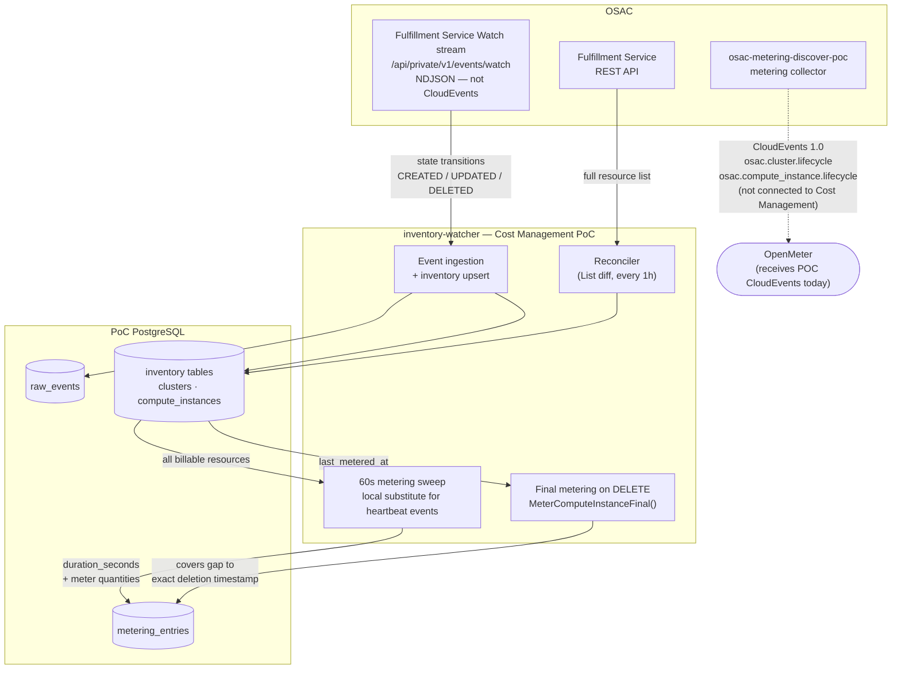
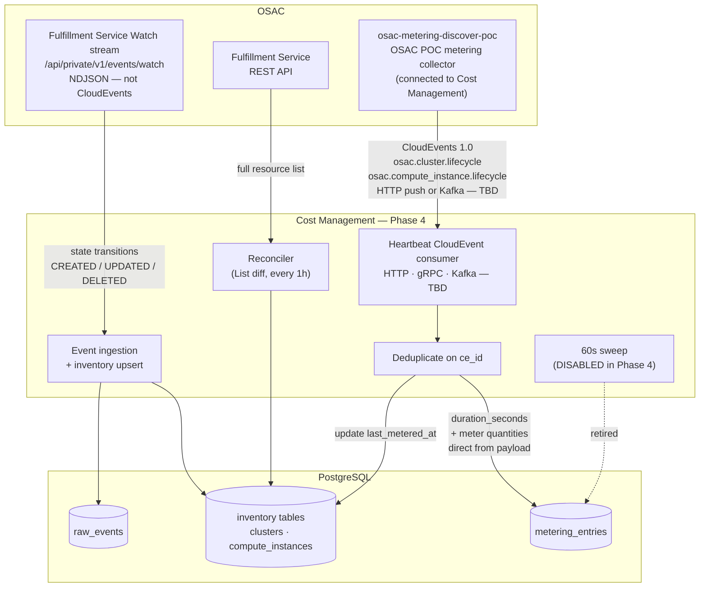

# Capacity-Based Metering Specification

> **Status:** PoC draft
> **Requirements:** POC-ARCH, REQ-1b, REQ-2, REQ-1a
> **Related:** [architecture.md](../architecture.md) · [event-types.md](../event-types.md) · [cost-calculation-spec-draft.md](../pricing/cost-calculation-spec-draft.md) · [cost_model_metric_feasibility.md](cost_model_metric_feasibility.md) · [cost-reports-feasibility.md](cost-reports-feasibility.md)

---

## 1. Purpose

This spec defines how Cost Management meters OSAC-provisioned infrastructure for the AI Grid PoC. Metering answers one question:

**How much capacity was provisioned, for how long, and for whom?**

The PoC charges on **provisioned capacity × duration**, not on actual CPU/memory consumption. No Prometheus scraping, no pod-level metrics, and no changes to the existing CSV ingestion pipeline.

---

## 2. Scope

### In Scope (PoC)

| Resource | Service | Billing model | Meters |
|---|---|---|---|
| Compute Instance (VM) | VMaaS | Capacity-based | `vm_uptime_seconds`, `vm_cpu_core_seconds`, `vm_memory_gib_seconds` |
| Cluster | CaaS | Capacity-based | `cluster_uptime_seconds`, `cluster_worker_node_seconds`, `cluster_worker_node_count` |
| Bare Metal | BMaaS | Capacity-based (TBD) | Schema pending OSAC — see §8 |

### Out of Scope (PoC)

| Item | Reason |
|---|---|
| Usage-based metering (`*_usage_*` metrics) | Requires Prometheus inside VMs — see [cost_model_metric_feasibility.md](cost_model_metric_feasibility.md) |
| Storage / PVC / GPU metering | OSAC does not expose these today |
| Network data transfer | Requires flow monitoring |
| Rework of hourly CSV pipeline | New HTTP/event data path only |

---

## 3. Metering Principles

### 3.1 Allocation = Request

OSAC declares capacity via HostType / template specs (cores, memory, node count). For infrastructure billing there is no distinction between "requested" and "allocated" — the declared spec **is** the billable quantity. This makes all allocation-based Koku metrics computable without live telemetry.

### 3.2 Two Inputs, One Output

Metering requires two kinds of input:

| Input | Source | Provides |
|---|---|---|
| **State** | OSAC Watch stream (lifecycle events) + reconciler | Which resources exist, their specs, billable state, tenant/project |
| **Duration** | 60-second sweep (PoC) or OSAC heartbeat CloudEvents (target) | How long each billable resource has been active |

The Watch stream alone is insufficient: it emits on state transitions (CREATED/UPDATED/DELETED), not periodically. A VM in `RUNNING` with no subsequent events would produce zero metering without a time-based mechanism.

### 3.3 Immutable Audit Trail

Every metering increment is stored as a row in `metering_entries`, linked to the source event (when applicable) or sweep timestamp. Raw events are never modified after insert. 

---

## 4. Event Sources

### 4.1 PoC Implementation (current)

The PoC consumes only the **OSAC Fulfillment Service Watch stream** for inventory sync. OSAC metering collector (`osac-metering-discover-poc`) exists and produces the correct CloudEvents, but it is not yet connected to Cost Management — it currently emits to OpenMeter. A local 60-second sweep fills that gap.



| Component | Interval | Role |
|---|---|---|
| Watch stream | Real-time | State transitions → inventory upsert, raw event log |
| Reconciler | Configurable (default 1h) | Catch missed Watch events via List API diff |
| Metering sweep | **60s** ([ADR-001](../../decisions/001-metering-sweep-interval.md)) | Produce time-based metering for all billable resources |
| Final metering | On DELETE | Capture usage from `last_metered_at` to exact deletion timestamp |

Implementation: `inventory-watcher/internal/metering/`.

> **Why a local sweep?** The Watch stream only fires on state changes. A VM in `RUNNING` with no subsequent events produces zero metering without a periodic signal. Because POC collector is not yet connected, the sweep replicates what heartbeat CloudEvents will eventually provide. See [ADR-003](../../decisions/003-heartbeat-emitter-vs-sweep.md) for the full decision record.

### 4.2 Target Implementation (Phase 4 — OSAC heartbeat collector connected)

In Phase 4, POC metering collector is reconfigured to emit its CloudEvents to Cost Management instead of OpenMeter. The Watch stream continues to drive inventory sync; heartbeat CloudEvents become the sole source of metering entries.

> **Important:** The Watch stream and the heartbeat collector are **two completely separate transports**. The Watch stream (`/api/private/v1/events/watch`) is the fulfillment service's proprietary NDJSON format — it is not CloudEvents and carries no metering quantities. Heartbeat CloudEvents arrive via a separate transport (HTTP, gRPC, or Kafka — TBD). Do not conflate them.



On receipt of a heartbeat CloudEvent, Cost Management will:

1. Receive via HTTP endpoint, gRPC server-streaming, or Kafka consumer (transport TBD — see Open Question 2)
2. Deduplicate on `ce_id` (stored in `raw_events`)
3. Extract `duration_seconds` and meter quantities directly from the event payload
4. Write `metering_entries` rows — same schema and meter names as today
5. Update `last_metered_at` on the inventory record
6. **The local sweep is disabled** — the collector is now the sole duration source

The `metering_entries` table, meter names, cost calculation pipeline, and reports are all unchanged. Only the producer changes. See [event-types.md](../event-types.md) for CloudEvent schemas and [ADR-003](../../decisions/003-heartbeat-emitter-vs-sweep.md) for the full tradeoff analysis.

#### 4.2.1 DELETE gap risk

The PoC sweep includes `MeterComputeInstanceFinal()` — a final metering entry written at the exact deletion timestamp when a DELETE event arrives, covering the gap from `last_metered_at` to that moment. OSAC POC collector has no equivalent: if a resource is deleted between two poll cycles, the collector never sees it again and the gap goes unmetered.

**For Phase 4, one of the following must be agreed with OSAC:**

| Option | Description | Preferred? |
|---|---|---|
| **Final heartbeat on DELETE** | The collector emits one last CloudEvent when a resource is deleted, timestamped to the moment of deletion. Cost Management writes the final metering entry from that payload. | Yes — preferred |
| **Reconciliation sweep (DELETE only)** | Cost Management keeps a lightweight sweep running alongside the collector that detects deletions via the Watch stream and fills the final metering gap. The full sweep is still disabled. | Fallback |

This must be resolved as part of the Phase 4 OSAC handoff.

### 4.3 Transport Options

| Option | Status | Notes |
|---|---|---|
| A — Watch stream + sweep | **PoC default** | [ADR-002](../../decisions/002-arguments-against-kafka.md) |
| B — HTTP push | Phase 4 candidate | Cost Management exposes an HTTP endpoint; collector POSTs CloudEvents to it. REQ-1b names this explicitly. Simplest path given OSAC POC collector already uses `curl`. |
| C — gRPC server-streaming | Phase 4 candidate | OSAC's native protocol (`osac.public.v1`) is gRPC with a REST gateway on top. A productionised collector could stream CloudEvents via a gRPC push interface — architecturally coherent and consistent with how Cost Management already integrates with OSAC (port 8010). Requires Cost Management to expose a gRPC receiver service and OSAC POC collector to be rewritten beyond shell scripts. |
| D — Kafka | Deferred | Only if multi-consumer fan-out is required. See [ADR-002](../../decisions/002-arguments-against-kafka.md). |
| E — REST polling | Fallback only | 60s snapshot granularity; misses inter-poll deletions. |

> **On gRPC:** REQ-1b names HTTP or Kafka, but OSAC's primary API surface is gRPC — the Watch stream itself is `osac.public.v1.Events` gRPC streaming; the Cost Management `inventory-watcher` reaches it via the REST gateway as a convenience, not because gRPC is unavailable. gRPC is architecturally the most native fit for a production collector. The practical constraint for Phase 4 is that OSAC POC collector (`osac-metering-discover-poc`) is currently shell scripts, not a gRPC client.

Requirements reference "heartbeat events via HTTP or Kafka" (REQ-1b). The PoC satisfies this functionally via the sweep until OSAC delivers native heartbeat CloudEvents.

---

## 5. Meters

Six discrete meters drive all feasible Koku cost model metrics for CaaS/VMaaS.

### 5.1 VMaaS Meters

| Meter | Unit | Formula | Stored per sweep/event |
|---|---|---|---|
| `vm_uptime_seconds` | seconds | `duration_seconds` | 1 row per VM |
| `vm_cpu_core_seconds` | core-seconds | `cores × duration_seconds` | 1 row per VM |
| `vm_memory_gib_seconds` | GiB-seconds | `memory_gib × duration_seconds` | 1 row per VM |

**Billable states:** `COMPUTE_INSTANCE_STATE_RUNNING`
**Non-billable:** `STOPPED`, `DELETED`, and all other states

### 5.2 CaaS Meters

| Meter | Unit | Formula | Stored per sweep/event |
|---|---|---|---|
| `cluster_uptime_seconds` | seconds | `duration_seconds` (control plane) | 1 row per cluster |
| `cluster_worker_node_seconds` | node-seconds | `SUM(node_count × duration_seconds)` per node set | 1 row per cluster (aggregated) |
| `cluster_worker_node_count` | count | `MAX(node_count)` per node set | Snapshot from inventory |

**Billable states:** `CLUSTER_STATE_READY`, `CLUSTER_STATE_PROGRESSING`
**Non-billable:** `FAILED`, `UNSPECIFIED`, and all other states

Control plane uptime and worker node time are metered separately. Worker node seconds are accumulated across all node sets in the cluster's `node_sets` spec.

### 5.3 Unit Conversions (for cost calculation)

| Meter unit | Koku input unit | Conversion |
|---|---|---|
| seconds | hours | `÷ 3600` |
| core-seconds | core-hours | `÷ 3600` |
| GiB-seconds | GiB-hours | `÷ 3600` |
| node-seconds | node-hours | `÷ 3600` |

---

## 6. Metering Pipeline

### 6.1 End-to-End Flow

```
OSAC event or 60s sweep
  │
  ├─► Validate & deduplicate (ce_id for events)
  │
  ├─► UPSERT inventory (clusters, compute_instances)
  │     └── Auto-register tenant on first event (REQ-1b)
  │
  ├─► If billable state:
  │     INSERT metering_entries (one row per meter)
  │     UPDATE last_metered_at on inventory record
  │
  ├─► On DELETE (if previously billable):
  │     INSERT final metering_entries (last_metered_at → deleted_at)
  │
  └─► [30s Rater] Rate lookup → INSERT cost_entries
        └─► [planned] Quota evaluation → alerts → OSAC
```

### 6.2 Metering Entry Schema

Each row in `metering_entries` represents one meter increment for one resource over one time window:

| Field | Source |
|---|---|
| `resource_type` | `cluster` or `compute_instance` |
| `resource_id` | OSAC resource UUID |
| `tenant_id` | From event subject / inventory |
| `meter_name` | One of the six meters above |
| `value` | Calculated quantity |
| `unit` | `seconds`, `core_seconds`, `gib_seconds`, `node_seconds` |
| `period_start` | `last_metered_at` or `created_at` (sweep) / `ce_time - duration_seconds` (event) |
| `period_end` | Sweep timestamp or `ce_time` |

### 6.3 Restart Recovery

`last_metered_at` on each inventory record is the reconciliation point. After a restart, the first sweep covers exactly the gap since shutdown — no usage is lost.

### 6.4 Volume Estimates

At 60s intervals, one billable VM produces 3 metering rows per minute (~4,320/day). A cluster produces 2–3 rows per minute. For 100 VMs: ~432,000 rows/day — manageable with indexing and periodic aggregation into summary tables.

---

## 8. Bare Metal (BMaaS)

Bare metal metering is scoped (REQ-8) but the OSAC CloudEvent schema is not yet defined. Expected shape:

| Meter (proposed) | Unit | Formula |
|---|---|---|
| `bm_uptime_seconds` | seconds | `duration_seconds` |
| `bm_cpu_core_seconds` | core-seconds | `cpu_cores × duration_seconds` |
| `bm_memory_gib_seconds` | GiB-seconds | `memory_gib × duration_seconds` |

The metering pipeline will treat bare metal identically to VMs once the event schema is confirmed — same sweep pattern, same `metering_entries` table, same cost calculation path.

---

## 9. SLA and Timing

| Stage | Target | Requirement |
|---|---|---|
| Event ingestion | Real-time (Watch stream) | REQ-1 |
| Metering sweep / heartbeat processing | ≤ 60s | REQ-2, ADR-001 |
| Cost calculation | ≤ 60s after metering | REQ-2 |
| End-to-end (OSAC emit → cost available) | ≤ 90s | REQ-2 |
| Quota status API | Sub-second (cached aggregates) | REQ-9 |

The 60-second sweep interval directly satisfies the processing SLA: metering entries are available within one sweep cycle of any state change.

---

## 10. Tenant and Project Attribution

All metering entries carry `tenant_id`. Project attribution comes from the inventory record, populated from OSAC event data or reconciler List responses.

| Behavior | Detail |
|---|---|
| First event auto-registers tenant | REQ-1b — no pre-provisioning required |
| Project mapping | REQ-3a — costs drill down to project within tenant |
| Multi-tenant shared infra | Each resource's tenant/project from OSAC spec, not inferred |

---

## 11. Acceptance Criteria Mapping

| Requirement | How metering satisfies it |
|---|---|
| POC-ARCH: Costs from provisioned capacity | Meters use declared cores/memory/node count × duration |
| POC-ARCH: Heartbeat events drive cost | Sweep (PoC) / OSAC collector (target) provides duration |
| POC-ARCH: No workload cluster metrics | No Prometheus; allocation from OSAC specs only |
| POC-ARCH: Demo-ready within SLA | 60s sweep + planned cost calculation ≤ 90s E2E |
| REQ-1b: Parse tenant/project/resource/config | Inventory upsert from events; meters use spec fields |
| REQ-2: Process within 60s | Sweep interval = processing interval |
| REQ-1a: Cluster order lifecycle | Cluster state tracked; billable during READY/PROGRESSING |

---

## 12. PoC Phasing

| Phase | Deliverable | Status |
|---|---|---|
| **1a** | Inventory sync + metering sweep for VMs | Implemented |
| **1b** | Cluster metering (`cluster_uptime_seconds`, `cluster_worker_node_seconds`) | Implemented |
| **1c** | Final metering on DELETE | Implemented (VMs) |
| **2** | Cost calculation (`metering_entries` → `cost_entries`) | **Implemented** — Rater worker (30s sweep), flat + tiered rate support, `rates` and `cost_entries` tables |
| **2b** | MaaS CloudEvent ingest + token-based metering | **Partial** — `POST /api/v1/events` handles `osac.model.lifecycle`; `maas_tokens_in/out`, `maas_requests` meters emitted; OSAC event schema TBD |
| **3** | Cost reports API (tenant/project drill-down) | Planned |
| **4** | Switch to OSAC heartbeat CloudEvents (retire sweep) | Blocked on OSAC collector |
| **5** | Bare metal metering | Blocked on OSAC BMaaS schema |
| **6** | Quota evaluation + threshold alerts | **Partial** — quota pull API (`GET /api/v1/quotas/{tenant_id}`) implemented; push alerts planned — see [alerting-spec-draft.md](../boundary_monitoring/alerting-spec-draft.md) |

---

## 13. Open Questions

| # | Question | Owner | Impact |
|---|---|---|---|
| 1 | When will OSAC metering collector emit heartbeat CloudEvents? | OSAC | Determines when to retire local sweep |
| 2 | Heartbeat transport: HTTP push vs gRPC streaming vs Kafka? | OSAC + Cost | REQ-1b names HTTP/Kafka; gRPC is architecturally valid given OSAC's native gRPC API — see §4.3. PoC uses local sweep as interim. |
| 3 | HostType catalog join for `cores_per_node` on clusters? | OSAC + Cost | Needed for `node_core_cost_per_*` metrics |
| 4 | BMaaS CloudEvent schema and billable states? | OSAC | REQ-8 |
| 5 | Network resource metering (VNets, subnets, IPs)? | OSAC + Cost | Phase 3 — not in initial PoC |

---

## 14. References

- [POC-ARCH requirements](../../requirements/poc_requirements_overview.md#poc-arch-capacity-based-charging-model)
- [ADR-001: Metering sweep interval](../../decisions/001-metering-sweep-interval.md)
- [ADR-002: Watch stream instead of Kafka](../../decisions/002-arguments-against-kafka.md)
- [Cost calculation and billing spec](../pricing/cost-calculation-spec-draft.md)
- [Cost model metric feasibility](cost_model_metric_feasibility.md)
- [Cost reports feasibility](cost-reports-feasibility.md)
- [Demo scenario](../../demos/demo-scenario-1.md) — end-to-end walkthrough
- [Koku cost model constants](https://github.com/project-koku/koku/blob/main/koku/api/metrics/constants.py)
- [OSAC metering discover POC](https://github.com/masayag/osac-metering-discover-poc)
